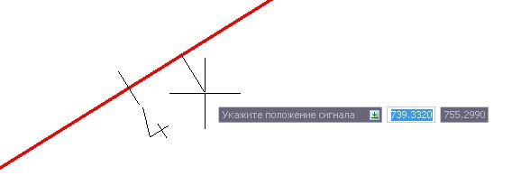
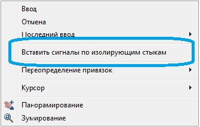
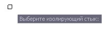
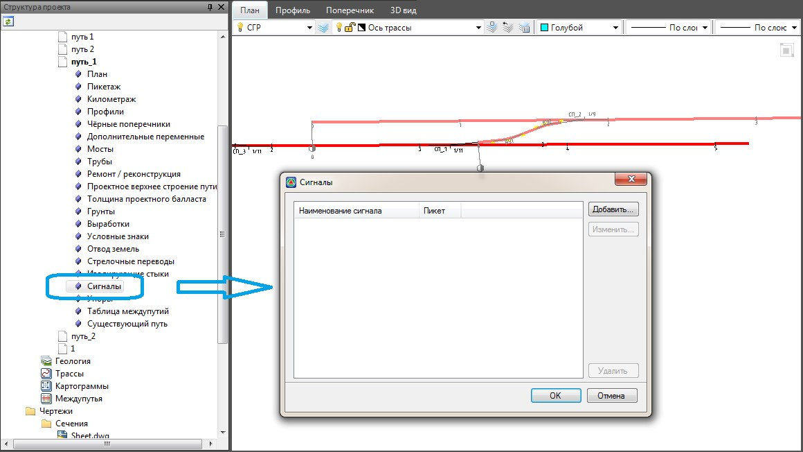
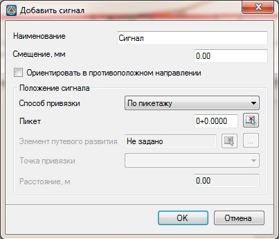
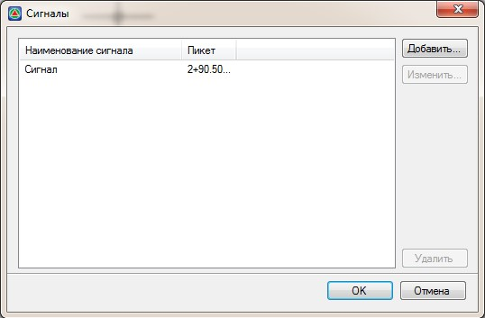

# Расстановка элементов путевого развития (сигналов, изостыков и упоров)

Вставка всех элементов путевого развития производится одинаковым образом, поэтому подробно рассмотрим вставку данных элементов на примере объекта **Сигналы**.

Вставка элементов путевого развития (сигналов, изостыков, упоров) может осуществляться несколькими способами: Через основное меню **Без привязки** и **С привязкой к объектам путевого развития**, через соответствующую таблицу в **Структуре проекта**.

* Для вставки объекта **Сигнал без привязки**:

1. Выберите элемент меню Задачи - Станции - Добавить сигнал, курсор примет форму прицела:

   

2. Передвигая курсор мыши по подобъекту укажите место вставки объекта **Сигнал** левой кнопкой мыши.

* Объект **Сигнал** можно привязать к предварительно созданному изолирующему стыку. В результате чего, перемещение объекта **Изостыка** всегда будет приводить к перемещению сигнального объекта.

Для этого:

1. На этапе ввода объекта **Сигнала** нажмите правой кнопкой мыши, откроется контекстное меню:

   

2. Выберите элемент меню **Вставить сигналы по изолирующим стыкам**, курсор примет форму прицела:

   

3. Укажите **Изолирующий стык**. В результате добавленный объект **Сигнал** будет привязан к **Изостыку**.

* Для создания объектов путевого развития через соответствующую таблицу в **Структуре проекта**:

1. В окне **Структура проекта** раскройте дерево таблиц текущего подобъекта и откройте таблицу **Сигналы**:

   

2. Нажмите кнопку **Добавить**, откроется окно создания объекта **Сигнал**:

   

   * **Наименование** - поле ввода для задания наименования добавляемого объекта.
   * **Смещение, мм** - смещение объекта влево\вправо относительно оси подобъекта.
   * **Ориентировать в противоположном направлении** - режим отображения объекта в противоположном направлении относительно пикетажа.

     В поле **Положение сигнала** задаются параметры определяющие положение объекта на модели пути.

   

   Механизмы привязки объектов путевого развития идентичны, поэтому данный функционал был описан выше, см. [п. Редактирование стрелочного перевода](edit_turnouts.md).

   

3. Задайте необходимые параметры и нажмите **Ок**. Созданный объект путевого развития отобразится в списке таблицы **Сигналы**:

   

4. Нажмите **Ок**. В результате программа вставит созданный **Сигнал** в модель текущего подобъекта.
