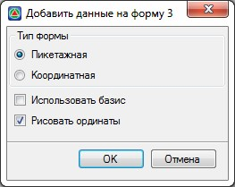
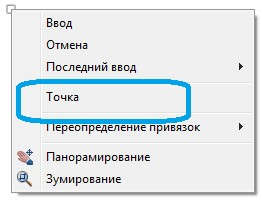
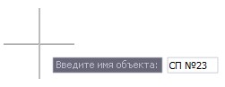

# Добавление дополнительных данных в таблицу

Функция позволяет путем ручного выбора выносить данные по Форме 3 для любых имеющихся объектов путевого развития, а также любой другой точки, не являющейся специализированным объектом, с дальнейшим ее именованием.

Для этого:

1. Выберите меню **Задачи - Станции - Утилиты - Добавить данные в форму 3**, откроется диалоговое окно:

   

   

   Все имеющиеся опции в данном окне подробно описаны в [предыдущем пункте](automatic_spreadsheet.md).

   

   Выполните необходимые настройки и нажмите **ОК**.

2. Для правильного ориентирования добавляемых данных необходимо указать начальную и конечную точки ранее созданной таблицы по **Форме 3**.
3. Далее выберите левой кнопкой мыши объекты путевого развития которые необходимо добавить в таблицу.

   

В результате данные по выбранным объектам автоматически попадут в таблицу.

Если необходимо добавить данные в форму 3 по какому - либо объекту не являющимся программным объектом путевого развития, нажмите правой кнопкой мыши, выберите пункт **Точка**:

далее укажите его положение и наименование:

В результате данные отобразятся в таблице.