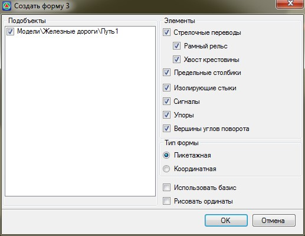
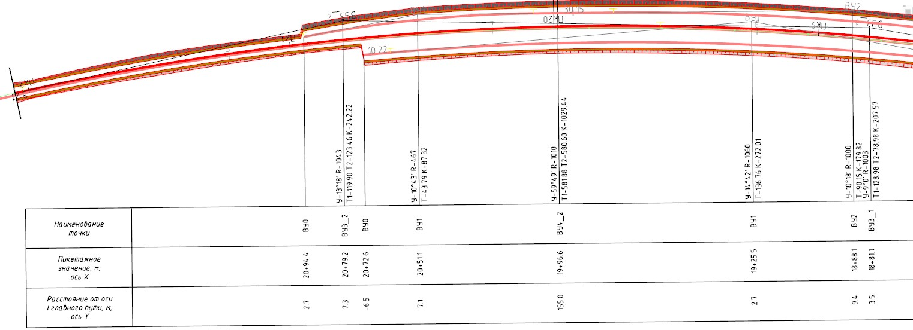

# Автоматическая отрисовка таблицы по Форме 3

Функция позволяет автоматически сформировать и отрисовать в окне **План** таблицу согласно Формы 3 ГОСТа Р 21.1702-96.

Для этого:

1. Выберите меню **Задачи - Станции - Утилиты - Вставить форму 3 на план**, откроется диалоговое окно:

   

   В левой части окна выберите те модели **Железных дорог** данные с которых будут участвовать в формировании таблицы.

   В поле **Элементы** выберите те по которым будут вынесены данные в таблицу.

   В поле **Тип формы** выбирается тип представления данных, т.е. в формате **ПК+ (Пикетажная)** либо **XY (Координатная)**.

   Включение опции **Использовать базис** позволяет вычислять в таблице **Пикетажное значение (ось Х**) и **Расстояние от оси главного пути (ось Y)** относительно указанного базиса.

   

   В качестве базиса, например, может быть указана точка станционного или пассажирского здания.

   

   Если **Тип формы** выбран **Пикетажная** и установлена опция **Использовать базис**, то в таблице **Пикетажное значение (ось Х)**, значения будут вычисляться согласно схеме ниже:

   

   А если **Тип формы** выбран **Координатная** и установлена опция **Использовать базис**, то в таблице **Пикетажное значение (ось Х)** и **Расстояние от оси главного пути (ось Y)** будут вычисляться согласно схеме ниже:

   

   Опция **Рисовать ординаты** позволяет от каждого снесенного элемента в таблицу отрисовать ординаты.

   Задайте все необходимые настройки и нажмите **ОК**.

2. Укажите начальную и конечную точки таблицы.

   

   Если была установлена опция Указать базис, то предварительно необходимо указать точку которая будет являться базисом.

   

В результате в окне **План** будет отрисована таблица по форме 3 в которой вынесены данные по объектам путевого развития попавшие в область нарисованной таблицы:

