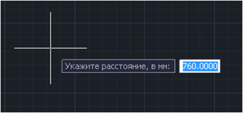

# Создание оси пути по головке рельса

Данная функция позволяет создавать ось существующего пути и продольный профиль по существующей головке рельса, используя в качестве исходных данных структурные линии по левому и правому рельсу.

Для создания плана пути по головке рельса:

1. Cделайте текущей соответствующий подобъект **Железные дороги**;
2. Выберите элемент меню **План – Утилиты – Создать путь по головке рельса**;
3. Левой кнопкой мыши укажите на плане структурную линию опорного рельса и второго рельса;
4. В выпадающем списке укажите, относительно какого рельса необходимо откладывать плановое положение пути:

   

   

   При выборе опции **Расстояние от нижнего/верхнего рельса** программа по отметкам будет определять, какой рельс находится ниже или выше на соответствующем участке и от него будет откладываться плановое положение пути.

   

5. В выпадающем списке укажите, относительно какого рельса необходимо принимать отметки пути:

   



 При выборе опции **Профиль по опорному/по нижнему рельсу**, программа создаст черный профиль по СГР, скопировав отметки с опорного рельса, либо определив в каждой точке перелома нижний из двух рельсов и взяв отметки с него.



6. На последнем шаге введите в динамической строке расстояние, которое будет откладываться от выбранного рельса, для определения планового положения пути:

   

В результате программа создаст план существующего пути и профиль по СГР (черный профиль).



Если текущая модель железных дорог содержала какие либо данные, то при использовании функции **Создать путь по головке рельса** все данные будут потеряны.

