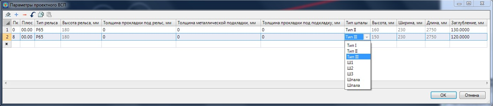

# Верхнее строение пути

Характеристики верхнего строения пути задаются в соответствующих таблицах структуры проекта подобъекта типа **Железная дорога**. Впоследствии по этим данным формируются ведомости и спецификации объемов работ. Рассмотрим эти таблицы более подробно.

Данные по типам рельсов и шпал задаются в таблице **Параметры проектного ВСП**. Откройте ее:

Тип рельса и Тип шпалы выбирается из выпадающего списка. В зависимости от типа выбранного рельса программа заполнит столбец Высота рельса. В зависимости от выбранного типа шпалы программа заполнит столбцы **Высота, Ширина, Длина** и **Заглубление**. Величина погружения шпалы также будет учитываться при расчете объема балласта.

Данные по рельсам и шпалам заполняются на основании Библиотеки типовых рельсов и **Библиотеки типовых шпал**. Для открытия данных библиотек воспользуйтесь меню: **Задачи – Верхнее строение пути – Библиотеки – Библиотека типовых рельсов/Библиотека типовых шпал**. При необходимости, данные библиотеки могут быть откорректированы и дополнены пользователем.

При выборе типа шпалы из выпадающего списка, величина Заглубление по умолчанию берется из Библиотеки типовых шпал, но при необходимости это значение может быт изменено непосредственно в таблице **Параметры проектного ВСП**.

Столбец **Толщина прокладки под рельс**, **Толщина металлической подкладки** и **Толщина прокладки под подкладку** используются только для расчета поперечников относительно ПГР и не используются для расчета **Рабочей ведомости верхнего строения пути**.



 Откорректированная Библиотека типовых рельсов/типовых шпал хранится на компьютере пользователя и может быть скопирована на другую рабочую машину. `C:\Users\....\AppData\Roaming\Topomatic\Robur rail\15.0\Support\Standards`, где 15.0 текущая версия программы. Файл **`rails.standard` – Библиотека типовых рельсов**, **`sleepers.standard` – Библиотека типовых шпал**.

