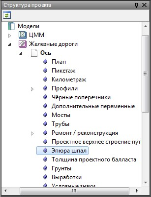
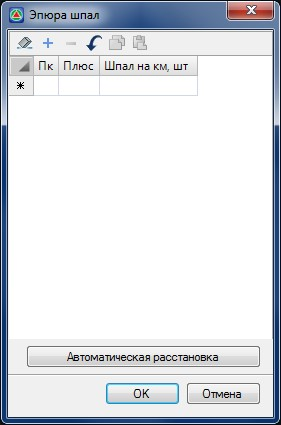
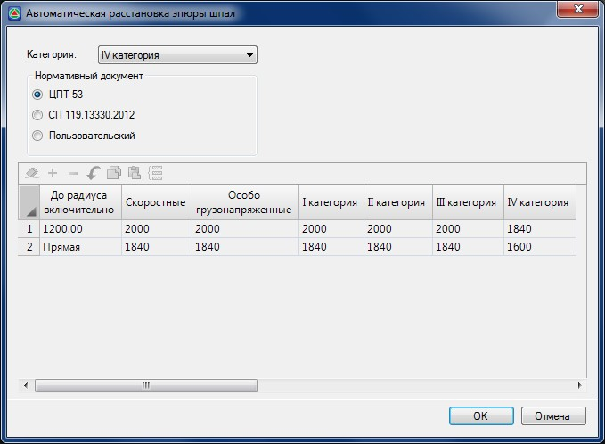
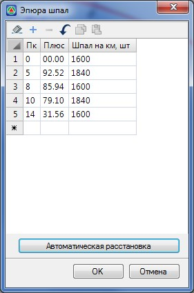
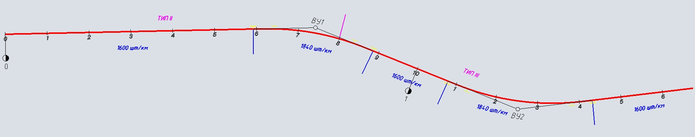
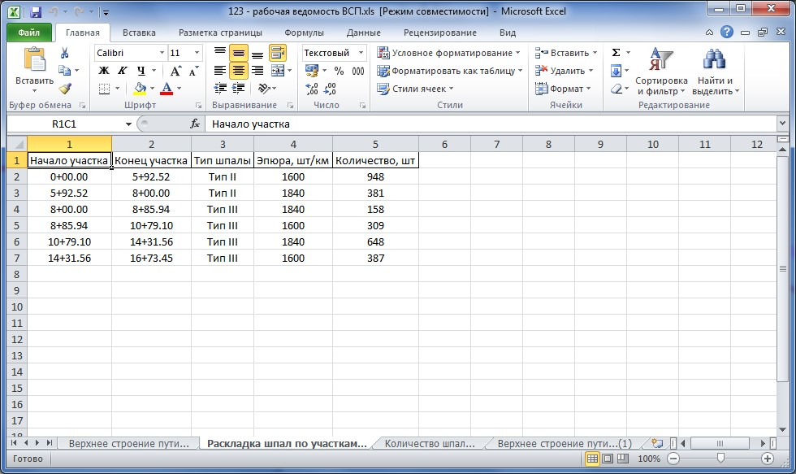

# Эпюра шпал

Данная таблица предназначена для подсчета количество шпал на заданном участке железнодорожного перегона. Расчет может быть выполнен автоматически, согласно **ЦПТ-53 (Технические условия на работы по ремонту и планово-предупредительной выправке пути)** или **СП 119.13330.2012 (Железные дороги колеи 1520 мм.) на железнодорожных перегонах**.

Таблица **Эпюра шпал** также находится в структуре проекта моделей типа **Железная дорога**:

Таблица **Эпюра шпал** может быть заполнена вручную или автоматически. В таблице задается пикет начала участка и количество шпал на километр. Пикетом конца участка является начало следующего участка, либо конец трассы, если введенный участок являлся последним.

Для автоматического расчета и заполнения данной таблицы нажмите кнопку **Автоматическая расстановка**. В результате откроется следующее окно:

В открывшемся диалоговом окне из выпадающего списка выберите категорию дороги и нормативный документ, по которому программа будет делать автоматический расчет количества шпал. Если в свойствах подобъекта уже была установлена категория, то программа выберет ее автоматически в выпадающем списке **Категория**.

Таблица в нижней части окна показывает расчетное количество шпал, которое будет использоваться при автозаполнении. Если выбран конкретный нормативный документ (ЦПТ-53 или СП 119.13330.2012), то данные в таблице не будут доступны для редактирования.

Если нужно выполнить расчет эпюры шпал по условиям отличным от указанных выше, в поле **Нормативный документ** необходимо выбрать пункт **Пользовательский**. Таблица в нижней части экрана станет доступна для редактирования. В таблице для разных категорий указывается количество шпал для различных значений радиусов и для прямых участков в плане. Пользовательские данные, заданные в таблице сохраняются и будут доступны при повторном обращении к таблице.

После задания всех необходимых данных нажмите **ОК**. Программа, используя параметры плана, автоматически заполнит таблицу **Эпюра шпал**:

Таким образом, программа рассчитает количество шпал на километр пути. В дальнейшем, при создании **Рабочей ведомости верхнего строения пути**, программа будет подсчитывать количество шпал каждого типа, на характерных участках пути.

Выходным документом, содержащим данные по проектному верхнему строению пути является рабочая ведомость верхнего строения пути. Для создания данной ведомости, выберите элемент меню: **Задачи – Верхнее строение пути – Рабочая ведомость верхнего строения пути**:

В ведомости на соответствующих вкладках расположены таблицы с объемами по проектному верхнему строению пути.