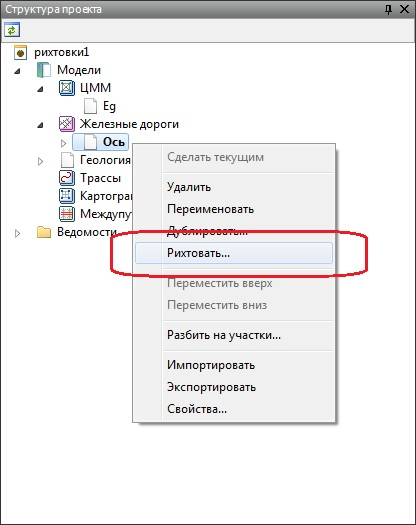
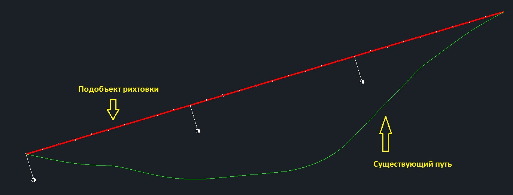

# Создание подобъекта рихтовок

Как было указано выше, перед началом работы необходимо создать подобъект, параметры которого будут подбираться по данным существующего пути. В этом случае, ось существующего пути должна быть предварительно создана и являться активной.

Для того, чтобы создать новый подобъект рихтовок необходимо выполнить следующие действия:

1. В **Структуре проекта** щелкните правой кнопкой мыши по наименованию модели текущего подобъекта (в данном случае предполагается что это ось существующего пути), в открывшемся меню выберите **Рихтовать**:

   

2. Автоматически создается новый подобъект **Железная дорога** (подобъект рихтовок), который также отображается в **Структуре проекта** и в окне **План**, в виде прямой, соединяющей начальную и конечную вершины существующего пути.

   