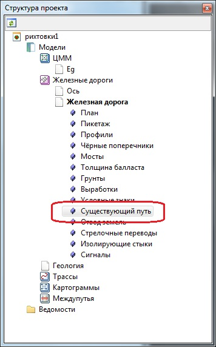
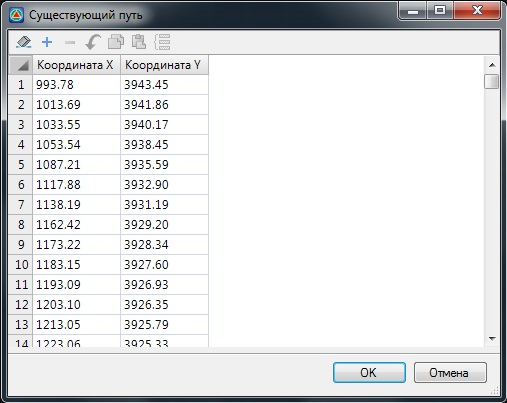

# Создание таблицы существующего пути

При создании подобъекта рихтовок, данные по существующему пути автоматически записываются в отдельную таблицу - **Существующий путь**, которая находится в структуре проекта и содержит координаты его вершин:



1. При необходимости, данные в таблице **Существующий путь** могут быть отредактированы.
2. При визуальном изменении положения вершин существующего пути в окне План, данные в таблице **Существующий путь** также автоматически обновляются. Для редактирования вершины щелкните по существующему пути (зеленая линия) левой кнопкой мыши, далее правой кнопкой мыши укажите вершину, которую необходимо отредактировать. Из появившегося контекстного меню выберите необходимую команду редактирования.



В программе также имеется возможность переназначить **Существующий путь**, т.е. изменить объект относительно которого будут считаться рихтовки.

Для этого:

1. Выберите меню **Задачи - Рихтовки - Назначить существующий путь**, курсор примет форму прицела.
2. Укажите левой кнопкой мыши соответствующий линейный объект (полилиния, трасса, структурная линия).