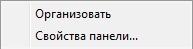
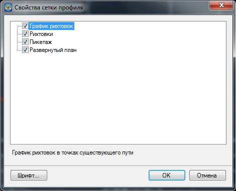
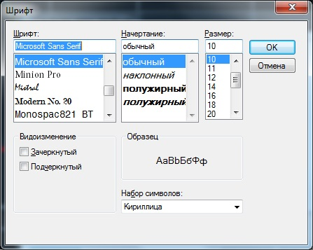

# Настройка отображения данных в сетке окна График кривизны

Для настройки видимости данных в сетке окна **Графика кривизны**:

1. Нажмите правой кнопкой мыши в нижней части окна **Графика кривизны**, откроется контекстное меню:

   

2. При выборе опции **Организовать** программа автоматически выравнивает ширину всех полей сетки окна **Графика кривизны**.
3. Для настройки отображения элементов выберите опцию Свойства панели, откроется окно:

   

   Для настройки видимости элементов установите или снимите соответствующие галочки и нажмите **Ок**.

   Для настройки шрифта, выделите элемент, для которого необходимо настроить шрифт и нажмите кнопку **Шрифт**, откроется окно:

   

   Задайте необходимые настройки и нажмите **ОК**.