# Подбор пути с помощью графика кривизны

График кривизны позволяет наглядно оценить степень кривизны трассы, границы криволинейных элементов и т.п.

**Рихтовки на графике кривизны** - группа функций позволяющих выполнять подбор параметров плана выбранного подобъекта на графике кривизны. Данный блок содержит в себе следующие функции:

**График кривизны** – открывает окно графика кривизны. Для этого необходимо выбрать элемент меню **Задачи – Рихтовки - Показать окно**:

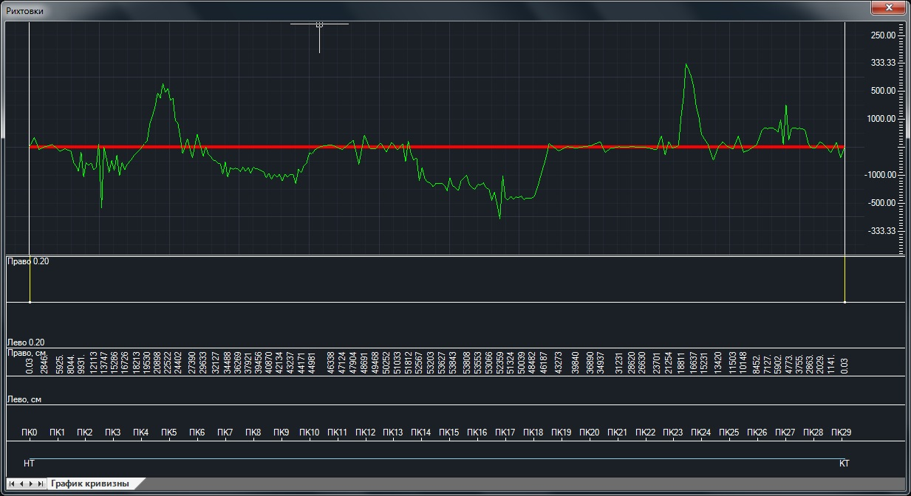

**Добавить границу** – позволяет визуально задать границы прямолинейных и криволинейных участков трассы на графике кривизны. Для этого щелкните дважды левой кнопки мыши по подобъекту рихтовок (красная линия) в том месте, где необходимо добавить границу на графике кривизны. Добавленные границы отображаются на графике кривизны вертикальными линиями.

**Удалить границу** – позволяет удалить точки границ элементов трассы с графика кривизны. Для этого необходимо выполнить следующие действия. Наведите курсор на точку границы, которую необходимо удалить, и нажмите правую клавишу мыши. Появится контекстное меню:

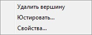

В появившемся контекстном меню выберите пункт **Удалить**.

**Юстировать границу** – позволяет с заданным шагом менять координаты точек границ прямых и кривых участков на графике кривизны. Для вызова данной функции наведите курсор на точку границы, положение которой необходимо корректировать, и нажмите правую клавишу мыши. В появившемся контекстном меню выберите пункт **Юстировать**. Откроется диалоговое окно:

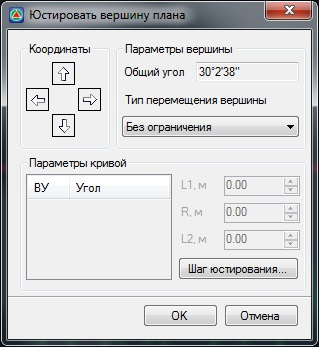



Функционал данного окна был описан в [Работа с трассой, в разделе Редактирование положения трассы](../../../rb_survey/alg/plan_track/redact_position_track.md).



**Редактировать границу** - позволяет задать точные координаты границы, а также зафиксировать длину прямой вставки справа. Для вызова данной функции наведите курсор на точку границы, положение которой необходимо корректировать и нажмите правую клавишу мыши. В появившемся контекстном меню выберите пункт **Свойства**. Откроется диалоговое окно:

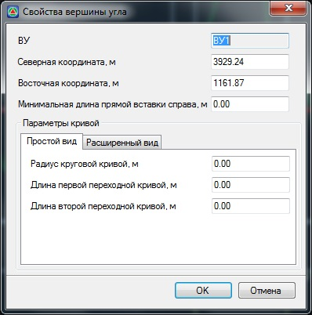

Внесите необходимые значения и нажмите **ОК**.



Функционал данного окна описан в [Работа с трассой, в разделе Редактирование положения трассы](../../../rb_survey/alg/plan_track/redact_position_track.md)



Информация о точке – позволяет получить информацию о выбранной точке существующего пути. Для этого необходимо выполнить следующие действия:

1. Выделите левой кнопкой мыши **Существующий путь** (зеленая ломаная линия на **Графике кривизны**) и щелкните правой кнопкой мыши по соответствующей вершине существующего пути, откроется контекстное меню:

   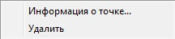

2. Выберите опцию **Информация о точке**. Откроется окно с информацией:

   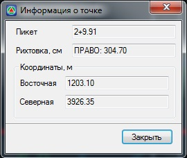

3. Нажмите **Закрыть**.



При необходимости удаления точки существующего пути выберите пункт меню **Удалить**.



Для удобства основные функции подбора элементов плана вынесены в отдельное контекстное меню.

При работе рекомендуется соблюдать последовательность подбора оси пути, которая должна быть следующей:

1. Назначаются и подбираются прямолинейные участки подобъекта рихтовок.
2. Назначаются и подбираются криволинейные участки подобъекта рихтовок.
3. При необходимости осуществляется редактирование прямолинейных и криволинейных участков.

С помощью левой кнопки мыши выделите подбираемый путь (красная линия на графике кривизны). Наведите курсор на соответствующий участок и нажмите правой кнопкой мыши по его центральному элементу. Если указанный участок является прямой, то появится контекстное меню следующего вида:

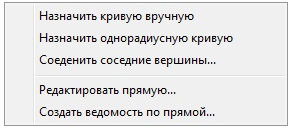

**Назначить однорадиусную кривую** – при выборе данного пункта меню программа автоматически впишет однорадиусную кривую без переходных кривых. При последующем редактировании пользователь имеет возможность задать переходные кривые, изменить радиус круговой кривой и добавить радиусы (создать многорадиусную кривую).

**Назначить кривую вручную** - при выборе данного пункта меню программа предложит самостоятельно указать начало и конец кривой, переходные кривые и круговые кривые.

Для объединения двух смежных кривых выберите опцию **Соединить соседние вершины**.

Параметры всех элементов также доступны для редактирования, как в табличной форме, так и визуально на экране.

Программа автоматически контролирует геометрию оси. При невозможности вписать кривую с указанными параметрами программа не даст завершить ввод кривой.

**Редактировать прямую** - при выборе этого пункта откроется окно **Редактирование участка прямой**:

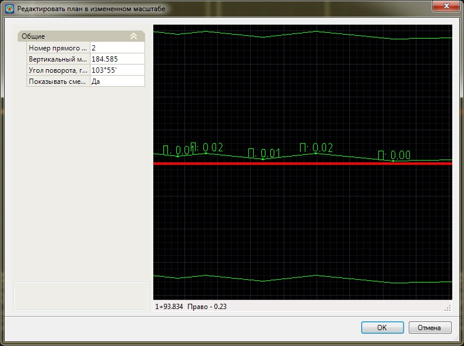

В графическом поле данного окна, зеленым цветом показана существующая ось и створ заданной величины, который не должны превышать значения рихтовок. Красным цветом показана намеченная прямая. Данное окно позволяет вести редактирование выбранной прямой в плане в измененном масштабе.

В этом окне можно внести следующие коррективы в намеченную прямую:

* С помощью мыши откорректировать положение прямой.
* Добавить или удалить вершину на намеченной прямой.
* Вписывать параметры закругления в переломы прямой.
* Юстировать переломы прямой.

Для этого:

Выделите с помощью левой кнопки мыши рихтуемый подобъект (красную линию) и нажмите правой кнопкой мыши по вершине которую необходимо редактировать , откроется контекстное меню:

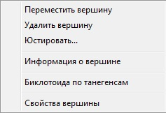



Функционал данного контекстного меню описан в [Работа с трассой, в разделе Редактирование положения трассы](../../../rb_survey/alg/plan_track/redact_position_track.md).



Для удобства пользования, в окне **Редактирования плана** в измененном масштабе в поле **Общие**, предусмотрена возможность изменения **Номера прямого участка, Вертикального масштаба, Угла поворота** и включение\выключение подписей величин **Смещений**:

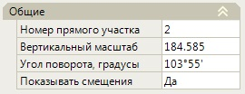

**Создать ведомость по прямой** - позволяет создать ведомость рихтовок для выбранного прямого участка. При выборе данного пункта открывается диалоговое окно:

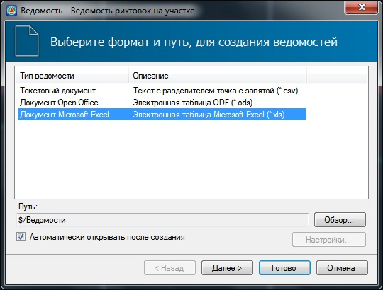

Для задания дополнительных настроек формирования ведомости нажмите Далее, откроется следующий шаг формирования ведомости:

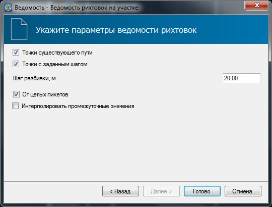

Установите опцию Включать точки существующего пути для выноса в ведомость пикетов точек существующего пути и рихтовок на них.

При установленной галочке **Точки с заданным шагом**, имеется возможность указать **Шаг разбивки** в соответствующем поле. В этом случае, в ведомость рихтовок помимо съемочных точек будут добавляться точки по отрихтованной трассе с заданным шагом.

При выключенной опции **Интерполировать промежуточные значения**, величины рихтовок промежуточных значений будут вычисляться по факту - как расстояние от оси рихтуемого подобъекта до оси существующего пути в точке интерполяции. Если данная опция включена, то величина рихтовки промежуточных значений будет вычисляться пропорционально, в зависимости от расстояния и величин рихтовок соседних значений.

Для формирования ведомости нажмите **Готово**.

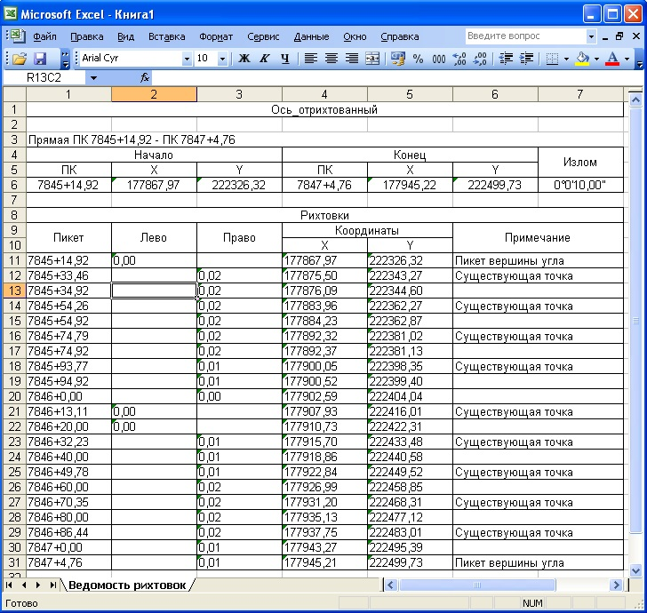

В результате программа сформирует ведомость по выбранному прямолинейному участку и откроет ее в **Excel**

Если участок является кривой, то появится контекстное меню следующего вида:

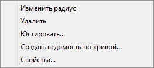

**Изменить радиус** - при выборе данного пункта имеется возможность, перемещая вершину кривой с помощью мыши, визуально подобрать радиус.

**Удалить** - для удаления вписанных параметров закругления.

**Юстировать** – При выборе этого пункта откроется диалоговое окно:

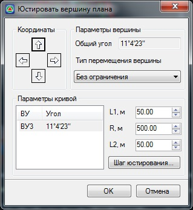

В данном окне в поле **Параметры кривой** пользователь может подбирать длины переходных кривых, а также изменять радиус вписанной горизонтальной кривой.

При нажатии на кнопку **Шаг юстирования** откроется диалоговое окно:

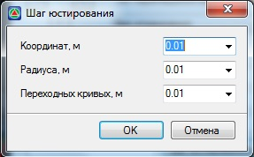

В данном окне пользователь может установить значения, на которые будут изменяться данные в окне **Юстирование** вершины при подборе горизонтальной кривой и переходных кривых.

**Создать ведомость по кривой** – функция аналогична функции **Ведомость по прямой**.

**Свойство** – при выборе этого пункта меню откроется диалоговое окно:

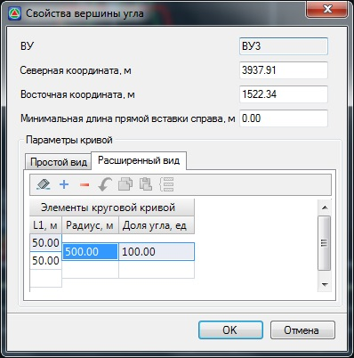

В нижней части окна в поле **Элементы круговой кривой** представлен список элементов кривой. В этом списке пользователь имеет возможность задать и отредактировать необходимые параметры кривой. Также в данном поле можно добавить/удалить радиус, сделав кривую многорадиусной/однорадиусной.

В программе также реализован механизм визуального редактирования параметров трассы в окне **График кривизны**. Пользователь имеет возможность редактировать параметры кривой, перемещая элементы кривой мышью за “привязки” элементов (на рисунке выделены желтым цветом):

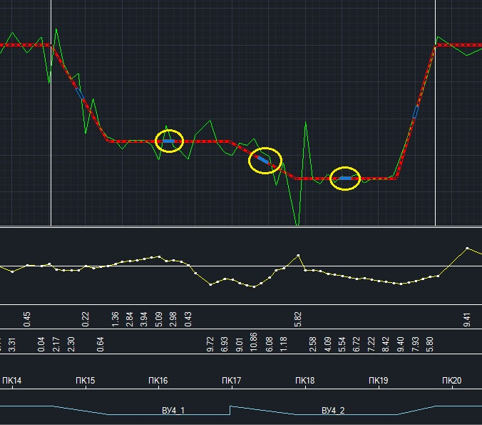

В окне **Графика кривизны** двойное нажатие левой кнопкой мыши на кривой приводит к разбивке ее на две составные кривые.