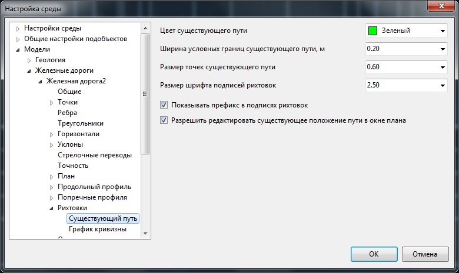
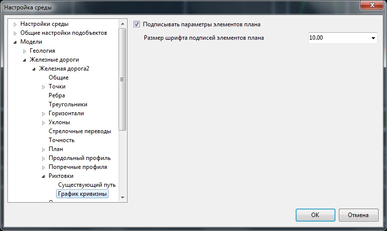

# Настройки

Ниже описанная группа опций предназначена для установки настроек объекта рихтовок и его отображения. Для их вызова, в **Структуре проекта** на необходимой модели **Железные дороги** нажмите правой кнопкой мыши, выберите пункт меню **Настройки**:

Раскройте дерево объектов **Модели - Железные дороги - Подобъект рихтовки - Рихтовки**:



В данном окне задаются настройки текущей модели **Железных дорог**. Для задания настроек по умолчанию для вновь создаваемых моделей, а также общих настроек проекта, воспользуйтесь элементом меню **Сервис - Настройки**.



**Цвет существующего пути** - данная настройка позволяет выбрать необходимый цвет отображения для элемента проекта **Существующий путь**.

**Ширина условных границ существующего пути, м** - максимальное значение отклонения рихтовок от оси пути. Параметр задается для визуального контроля величины рихтовки в окне **График кривизны**. В нижней части данного окна, вдоль существующего пути, отрисовывается коридор заданной ширины.

**Размер точек существующего пути** - в данном поле имеется возможность задать размер точек существующего пути.

**Размер шрифта подписей рихтовок** - в данном поле имеется возможность задать величину шрифта подписей рихтовок в окне **Редактирование плана в измененном масштабе**.

**Показать префикс в подписях рихтовок** - опция позволяющая включить\выключить префикс (П - право, Л - лево) в подписях смещений в окне **Редактирование плана в измененном масштабе**.

**Разрешить редактировать существующее положение пути в окне плана** - опция позволяющая включить\выключить возможность редактирования **Существующего пути** в **Плане**.

**Подписывать параметры элементов плана** - опция позволяет подписывать значения элементов плана на **Графике кривизны**. Размер шрифта подписей задается в соответствующем поле.
