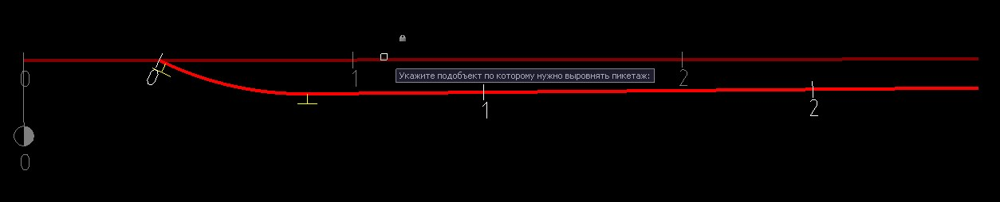
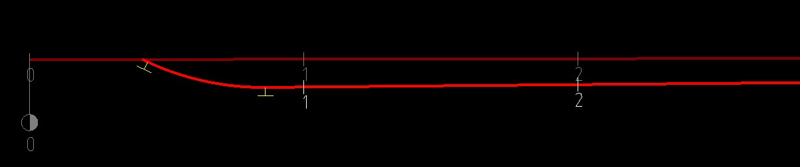

# Выровнять пикетаж по другому подобъекту

Данная функция позволяет автоматически выравнивать пикетаж одной трассы по другой. К примеру, это используется при проектировании железнодорожных станций, где на всех боковых путях используется пикетаж главного пути.

Для этого:

Выберите меню **План – Утилиты - Выровнять пикетаж по другому подобъекту**, курсор примет форму прицела. Укажите главный подобъект, по которому необходимо произвести выравнивание пикетажа:

В результате программа произведет выравнивание пикетажа текущей модели по выбранному подобъекту за счет ввода резаных пикетов в соответствующей таблице **Пикетажа**:



 Отображение резаных пикетов можно включить в Настройках текущей модели в разделе **План – Пикетаж**.


