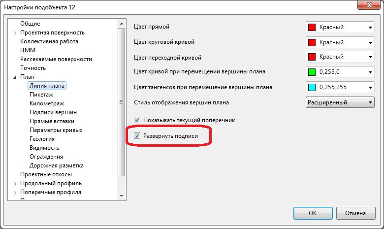

# Изменить направление оси

Для изменения направления оси трассы выберите меню **План - Изменить направление оси**. В результате программа изменит направление оси трассы и выполнит переразбивку пикетажа.



Все подписи элементов плана **(Пикетаж, Километраж и т.д.)** автоматически ориентируются по направлению пикетажа трассы. Если направление пикетажа трассы развернуто справа налево, то автоматическое ориентирование подписей элементов плана не обеспечивает читабельность чертежа, и требуется перевернуть все подписи.

Для этого:

1. В **Структуре проекта** нажмите правой кнопкой мыши на необходимую модель подобъекта, выберите из появившегося контекстного меню пункт **Настройки**.
2. В открывшемся окне в дереве настроек перейдите на вкладку **План – Линия плана**:

   

3. Установите опцию **Развернуть подписи** и нажмите **Ок**.

В результате все подписи элементов плана **(Пикетаж, Километраж и т.д.)** с учетом направления оси трассы будут ориентированы верно.


