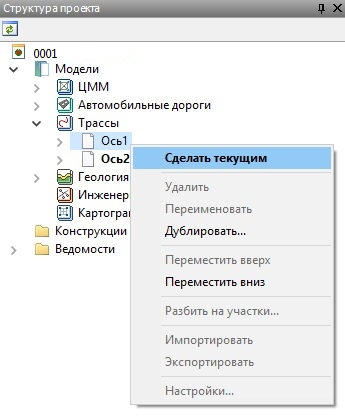
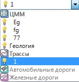

# Выбор текущей трассы

Проект может содержать неограниченное число трасс. Возможно редактирование только текущей модели. Процедура выбора текущей модели была описана в разделе **[Структура проекта.](../../../install_startup/startup/structure_project/structure_project.md)**

Для выбора текущей трассы можно воспользоваться:
* Деревом структуры проекта:

   

* Выпадающим списком менеджера моделей:

   

Также для выбора текущей трассы можно воспользоваться кнопкой **Сделать слой объекта текущим** , расположенной на стандартной панели, указав левой кнопкой мыши соответствующую ось.
