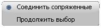

# Способы построения плана трассы

**Robur** поддерживает два способа задания трассы:



Данный метод позволяет создавать трассу из отдельных составляющих ее элементов (прямых участков, круговых кривых, клотоид, полилиний, структурных линий и прочих линейных объектов).

Для этого:

1. Выберите элемент меню **План – Создать ось из примитивов**. Курсор при этом примет форму прицела.
2. Укажите объект **ЦММ**, из которого необходимо создать трассу.

   

   Если указанный исходный объект соединяется с другими, то после его выбора появится контекстное меню:

   

* Чтобы автоматически создать трассу из набора примитивов, последовательно сопряженных друг с другом, выберите пункт **Соединить сопряженные**.
* Чтобы самостоятельно указать примитивы, из которых должна быть создана трасса:

  1. Выберите пункт **Продолжить выбор**.
  2. Левой кнопкой мыши последовательно выберите группу исходных примитивов. В зависимости от установленных настроек программы при выборе группы объектов может потребоваться использование дополнительной клавиши **Shift**.
  3. Для подтверждения выбора щелкните правой кнопкой мыши.

В результате программа на основе выбранных объектов создаст трассу и разобьет пикетаж.

Также имеется обратная возможность разбивки оси на ее исходные примитивы. Для этого выберите элемент меню **План – Разбить трассу на примитивы**.



 

В данном случае, как правило, проектирование плана трассы производят в следующей последовательности:

1. Определяют положение вершин углов поворота трассы.
2. Вписывают горизонтальные кривые.
3. Уточняют окончательное положение оси.

Чтобы определить ось трассы прямым указанием вершин:

1. Выберите элемент меню **План – Наметить/Продлить ось**. Курсор примет форму прицела.
2. Последовательно укажите левой кнопкой мыши положение вершин углов поворота трассы.
3. Для окончания ввода нажмите правую кнопку мыши. Появится контекстное меню:

   

* Выберите пункт **Ввод** для подтверждения положения введенных вершин. В этом случае программа создаст ось трассы и автоматически разобьет пикетаж.
* Для выхода из текущей команды нажмите пункт **Отмена**.
* Выберите пункт **Отменить последний сегмент**, если необходимо, не выходя из текущей команды, отменить ввод последней вершины угла.

