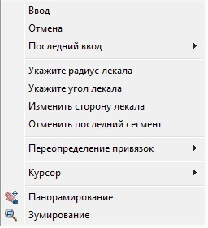
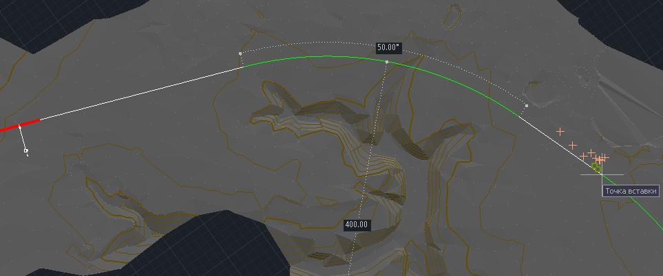
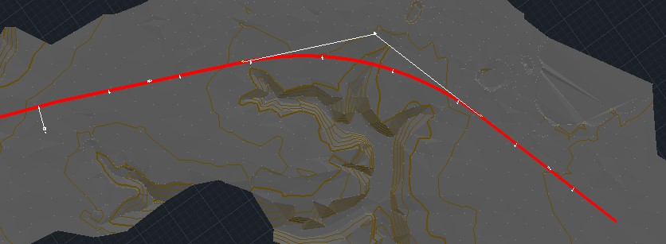

# Лекальное трассирование

Для упрощения процедуры трассирования в программе реализован механизм трассирования с помощью лекал. В этом режиме программа будет отображать положение следующего сегмента кривой заданного радиуса.

Для проектирования с использованием лекал в процессе ввода оси нажмите правую кнопку мыши. Появится контекстное меню:

* Чтобы задать радиус лекала, выберите пункт **Укажите радиус лекала**.
* Чтобы поменять угол между вводимым и следующим сегментом (между которыми строится лекало), выберите пункт **Укажите угол лекала**.
* Чтобы изменить сторонность отображения лекала, выберите пункт **Изменить сторону лекала**.
* Для отмены последнего введенного сегмента выберите пункт **Отменить последний сегмент**.

После задания необходимых параметров на экране появится отображение лекала (зеленая линия на схеме). Перемещаясь курсором по экрану, выберите оптимальное положение начала кривой и нажмите левую клавишу мыши:

Затем, перемещаясь курсором вдоль предполагаемой кривой, задайте ее длину и начало следующего элемента.

После завершения ввода элементов нажмите правую клавишу мыши. В открывшемся контекстном меню выберите пункт **Ввод**. Программа добавит к текущей оси созданные элементы.

