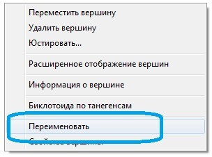
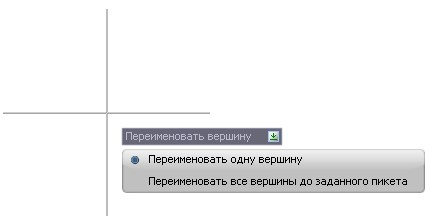
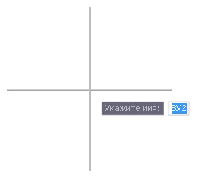
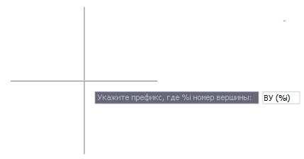
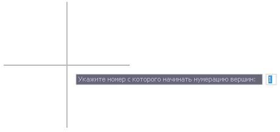
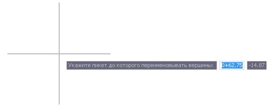

# Редактирование положения трассы

**Robur** имеет набор средств для редактирования положения трассы в плане. Можно перетаскивать вершины углов перелома вместе со вписанными кривыми при помощи мыши, плоскопараллельно перемещать прямолинейные участки трассы, удалять и вставлять дополнительные вершины.

Перед началом редактирования трассы выделите ее, щелкнув по ней левой кнопкой мыши.

В зависимости от установленных настроек программы при ее выделении элементы трассы могут отображаться в обычном или расширенном виде. Отображение трассы в расширенном виде предоставляет больший набор средств для ее редактирования.

Для отключения/включения расширенного режима отображения элементов трассы воспользуйтесь кнопкой , расположенной под графическим полем программы:

* **Для перемещения вершины угла перелома** перетяните ее левой кнопкой мыши в требуемое место.
* **Для перемещения вершины угла перелома вдоль тангенса** перетяните левой кнопкой мыши стрелку, расположенную на соответствующем тангенсе, рядом с редактируемой вершиной, в требуемое место. Отображение данных стрелок доступно при расширенном режиме отображения трассы.
* **Для вставки дополнительной вершины угла перелома** дважды щелкните левой кнопкой мыши на прямолинейном участке трассы.
* **Для удаления вершины угла перелома** щелкните по ней правой кнопкой мыши и из открывшегося контекстного меню выберите пункт **Удалить вершину**.
* **Для назначения радиуса круговой и длин переходных кривых**:

  1. Щелкните правой кнопкой мыши по вершине, в которую нужно вписать закругление.
  2. Из появившегося контекстного меню выберите пункт **Свойства**.
  3. В появившимся диалоговом окне задайте параметры закругления (радиус круговой кривой и длины переходных кривых). Для подтверждения ввода нажмите кнопку **ОК**.

     

     По умолчанию в данном окне задаются параметры однорадиусной кривой. Если необходимо в текущую вершину вписать составную кривую, перейдите на вкладку **Расширенный вид**:

     

     В данном окне показаны параметры вершины угла для многорадиусной кривой. Для того чтобы добавить еще один радиус и создать многорадиусную кривую, добавьте в соответствующем месте дополнительную строку с помощью кнопки . Задайте значение дополнительного радиуса и длину переходной кривой между двумя радиусами. Также необходимо в поле **Доля угла** задать коэффициенты, указывающие их соотношение между собой. При этом общий угол будет равняться сумме углов между тангенсами, составляющими многорадиусную кривую, которые вычисляются на основе заданного соотношения в долях.

     При перетягивании вершины угла с помощью мыши общий угол меняется, а составляющие его углы остаются в той же пропорции, в которой они были заданы изначально.

     

     Изменять свойства вершины можно только в определенных пределах, так, чтобы не нарушить условия сопряжения элементов трассы. Если задаются некорректные свойства вершины (кривые пересекаются или не выдерживается заданная минимальная длина прямой вставки), программа выдает соответствующее сообщение.

     

* **Для изменения нумерации вершин углов**

   При проектировании/создании плана трассы программа по умолчанию автоматически нумерует вершины углов поворота следующего вида: НТ, ВУ1, ВУ2…-ВУ15, КТ.

   При необходимости наименование каждой вершины может быть изменено.

   Для этого:

 1. В **Структуре проекта** нажмите правой кнопкой мыши на необходимую модель подобъекта, выберите из появившегося меню пункт **Настройки**.
 2. В открывшемся окне в дереве настроек перейдите на вкладку **План – Подписи вершин**: 

    

    Выключите опцию **Автоматического переименования вершин плана**, чтобы появилась возможность ручного переименования вершин углов поворота трассы. Для подтверждения заданных настроек нажмите **ОК**.

 3. Нажмите правой кнопкой мыши на вершине угла поворота трассы и выберите пункт меню **Переименовать**:

    

 4. В зависимости от необходимости переименования выбранной вершины или группы вершин выберите опцию: 

    

 * Выбрав опцию **Переименовать одну вершину**, в динамической строке введите новое имя вершины и нажмите **Enter**: 

   

   

   Изменить имя вершины также можно в окне **Свойств вершины**.

   

 * Выбрав опцию **Переименовать все вершины до заданного пикета**, необходимо указать:
  * Префикс имени вершин:
  
    

  * Номер начала нумерации вершин:
  
     

  * Пикет, до которого выполнить переименование:
  
     

 5. В результате с учетом заданных параметров вершины углов поворота трассы будут переименованы.

 * **Значение радиуса круговой кривой можно изменять визуально**. Для этого переместите, удерживая левой кнопкой мыши, стрелку, расположенную посередине вершины угла (или посередине вписанной кривой), в требуемое место.
 * **Положение вершины угла и параметры кривой можно менять перебором с заданным шагом**. Для этого щелкните правой кнопкой мыши по вершине угла и выберите из появившегося контекстного меню пункт **Юстировать**. Откроется следующие окно:

   

   Нажав кнопку **Шаг юстирования**, можно установить значения, на которые будут изменяться данные в окне **Юстирование вершины** при подборе координат вершины угла, радиуса круговой кривой и длин переходных кривых. Перемещение вершины угла возможно с помощью стрелок в левой части окна. А с помощью стрелок, расположенных рядом с полями ввода параметров кривой, можно изменять их значения на заданный **шаг юстирования**.

   При юстировании вершины угла она по умолчанию перемещается в ортогональных направлениях. Если же необходимо перемещать вершину вдоль входящего или исходящего тангенса, то выберите соответствующий режим из выпадающего списка, в поле **Тип перемещения вершины**.

   При юстировании элементов составной кривой в поле **Параметры кривой** необходимо выбрать, какая именно ее доля должна юстироваться.

 * **Для получения информации о параметрах текущего закругления** щелкните по нему правой кнопкой мыши и выберите из появившегося контекстного меню пункт **Информация о вершине**.

   Откроется окно, в котором будут представлены все необходимые параметры кривой:

   

* **Чтобы изменить направление оси трассы**, выберите элемент меню **План – Изменить направление оси**. Программа изменит направление оси трассы и переразобъет по ней пикетаж.
* **Удерживая левой кнопкой мыши центральный маячок прямолинейного элемента трассы, можно осуществлять его плоскопараллельный перенос**. Отображение данного маячка доступно только при расширенном режиме отображения трассы.
