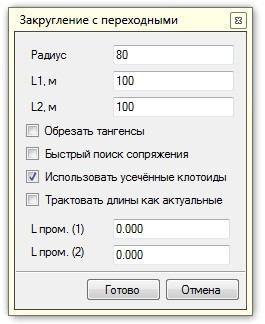
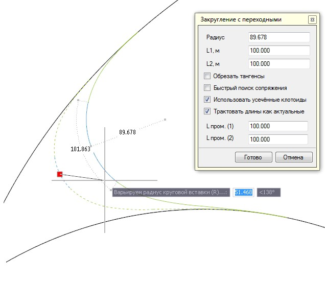

# Вогнутое сопряжение переходными кривыми с круговой вставкой

Для того, чтобы сопрячь произвольные элементы переходными кривыми с круговой вставкой:

1. Выберите элемент меню **Рисовать – Построения – L-R-L вогнутое**.
2. Последовательно укажите левой кнопкой мыши два сопрягаемые элемента (примитивы, дополнительные оси, трассы и пр.). Откроется диалоговое окно:

   

   В соответствующих полях (**Радиус, L1** и **L2**) задается радиус и длины первой и второй переходных кривых.

   Если в качестве сопрягаемых элементов выбраны примитивы (полилинии, отрезки, дуги и т.д.), то при включении опции **Обрезать тангенсы** программа автоматически выполнит обрезку и удаление элементов (тангенсов) по точке начала сопряжения.

   **Быстрый поиск сопряжения** – если данная опция установлена, то программа будет пытаться сопрячь примитивы в точке, близкой к указанным на исходных примитивах, либо будет рассматривать все возможные варианты.

   **Использовать усеченные клотоиды** – если данная опция установлена, то при вводе закругления программа при необходимости для сопряжения будет использовать усеченные клотоиды. Например, если в качестве исходного примитива выбрана дуга, то в этом случае исходную дугу и дугу сопряжения программа будет сопрягать усеченной клотоидой. Если галочка не установлена, то сопряжение будет осуществляться прямой клотоидой.

   При включении опции **Трактовать длины как актуальные** реальная (физическая) длина усеченных клотоид будет равна заданным значениям в полях **L1** и **L2**.

   В полях **L пром (1)** и **L пром (2)** задаются длины усеченных обратных клотоид, которые появляются при включении опции **Использовать усеченные клотоиды**, и в том случае, если сопряжение попадает на выпуклую арку. При этом если значения длин в данных полях не заданы (или = 0), то длина усеченных обратных клотоид принимается равной половине от заданного значения в поле **L1**.

   Пользователь имеет возможность графически изменять радиус сопряжения левой клавишей мыши, перемещая кривую на экране.

   

3. Для выхода из данной функции нажмите правую клавишу мыши или выберите **Готово**. Для завершения работы команды нажмите **Отмена**.
