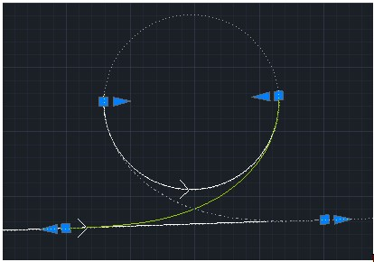
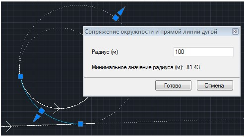
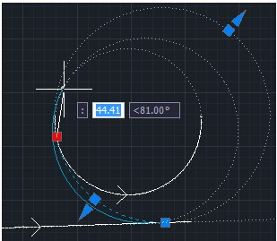

# Сопряжение окружности и прямой

## Сопряжение клотоидой

Чтобы сопрячь окружность/дугу и прямую клотоидой:

1. Выберите элемент меню **Рисовать – Построения – Окружность и прямую - Клотоидой**.
2. Последовательно укажите левой кнопкой мыши окружность/дугу и прямую. Программа подберет несколько вариантов сопряжения и отобразит их на экране:

   

3. Левой кнопкой мыши укажите нужный вариант на экране.
4. Для выхода из данной функции нажмите правую клавишу мыши, для завершения работы команды нажмите **Esc**.

## Сопряжение дугой

Чтобы сопрячь окружность/дугу и прямую дугой:

1. Выберите элемент меню **Рисовать – Построения – Окружность и прямую - Дугой**.
2. Последовательно левой кнопкой мыши укажите окружность/дугу и прямую. Программа построит сопряжение и откроется диалоговое окно:

   

3. Введите радиус в диалоговом окне или задайте его графически, перемещая мышкой точку сопряжения дуги и окружности или точку сопряжения дуги и прямой. Один из вариантов сопряжения можно выбрать, указав на него левой клавишей мыши.

   

4. Для выхода из данной функции нажмите правую клавишу мыши или выберите **Готово**, для завершения работы команды нажмите **Отмена**.
