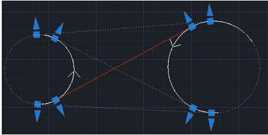

# Сопряжение двух окружностей

Данная функция сопрягает две окружности следующими способами:

## Сопряжение прямой

Чтобы сопрячь две окружности/дуги прямой:

1. Выберите элемент меню **Рисовать – Построения – Две окружности - Прямой**.
2. Последовательно укажите левой кнопкой мыши две окружности/дуги. Программа подберет несколько вариантов сопряжения и отобразит их на экране.

   

3. Укажите левой кнопкой мыши нужный вариант сопряжения.
4. Для выхода из данной функции нажмите правую клавишу мыши, для завершения работы команды нажмите **Esc**.

## Сопряжение переходными с прямой вставкой

Чтобы сопрячь две окружности/дуги переходными и прямой вставкой:

1. Выберите элемент меню **Рисовать – Построения – Две окружности переходными и прямой**.
2. Последовательно укажите левой кнопкой мыши две окружности/дуги. Программа построит несколько вариантов сопряжения и откроется диалоговое окно:

   

3. В диалоговом окне задайте необходимые длины переходных кривых.
4. С помощью левой кнопки мыши выберите один из вариантов сопряжения. Программа автоматически вычислит величину прямой вставки.
5. Для выхода из данной функции нажмите правую клавишу мыши или выберите **Готово**, для завершения работы команды нажмите **Отмена**.

## Сопряжение биклотоидой

Чтобы сопрячь две окружности/дуги биклотоидой:

1. Выберите элемент меню **Рисовать – Построения – Две окружности биклотоидой**.
2. Последовательно укажите левой кнопкой мыши две окружности/дуги. Программа построит сопряжение и откроется диалоговое окно:

   

3. В поле схема выберите одну из схем построения закругления, в другом поле введите параметр закругления, соответствующий схеме. В программе возможны следующие схемы закругления:

   * **Равенство параметров переходных (с1=с2)** – построение по равенству параметров клотоид (параметр клотоиды вычисляется как $c=R*L$, где **R** – радиус в конечной точке, **L** – полная длина клотоиды).
   * **Отношение длин переходных (L1/L2)** – построение по соотношению длин клотоид (длины клотоид подбираются программой автоматически).
   * **По заданной длине первой кривой (L1)** – построение по длине первой клотоиды (длина второй клотоиды подбирается программой автоматически).
   * **По заданной длине второй кривой (L2)** – построение по длине второй клотоиды (длина первой клотоиды подбирается программой автоматически).

    

   При использовании схемы **Равенство параметров переходных (с1=с2)** поле ввода является неактивным, все параметры вычисляются программой автоматически.

4. В диалоговом окне выберите схему сопряжения и задайте необходимые параметры сопряжения.
5. С помощью левой кнопкой мыши выберите один из вариантов сопряжения.
6. Для выхода из данной функции нажмите правую клавишу мыши или выберите **Готово**, для завершения работы команды нажмите **Отмена**.
