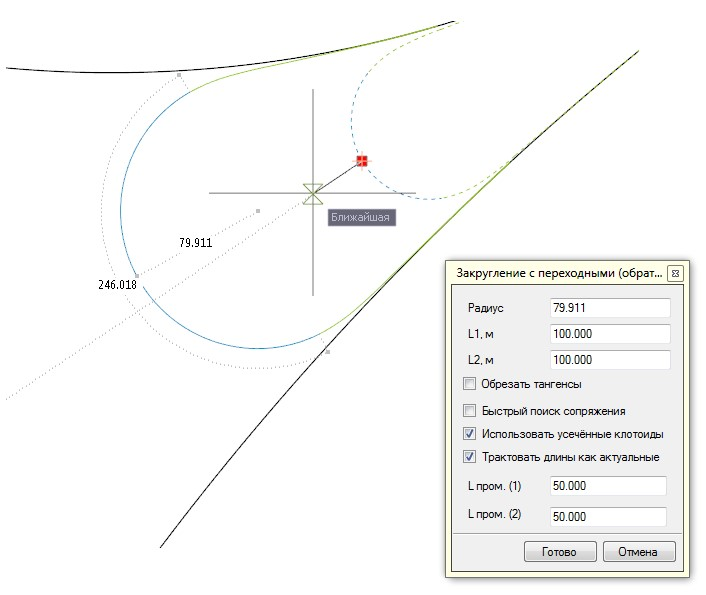

# Выпуклое сопряжение переходными кривыми с круговой вставкой

Для того, чтобы создать обратное сопряжение произвольных элементов переходными кривыми с круговой вставкой:

1. Выберите элемент меню **Рисовать – Построения – L-R-L выпуклое**.

   Данное сопряжение производится аналогично сопряжению **[L-R-L вогнутое](concave_conjugation.md)**.

2. Задайте необходимые параметры сопряжения.
3. Для выхода из данной функции нажмите правую клавишу мыши или выберите **Готово**, для завершения работы команды нажмите **Отмена**.
