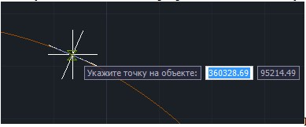

# Построение перпендикуляра/касательной к объекту

Чтобы построить перпендикуляр и касательную к объекту, выберите элемент меню **Рисовать – Построения – Перпендикуляр/касательная к объекту**, затем левой клавишей мыши укажите исходный линейный объект. На экране появится перекрестие, движущееся по направлению курсора вдоль выбранного объекта. Одна из линий перекрестия является перпендикуляром к выбранному объекту, другая – касательной. С помощью привязок укажите положение перекрестия и нажмите левую клавишу мыши.



 В качестве исходного объекта может выступать любой линейный объект, например, ось трассы.


