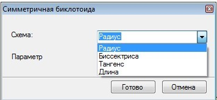
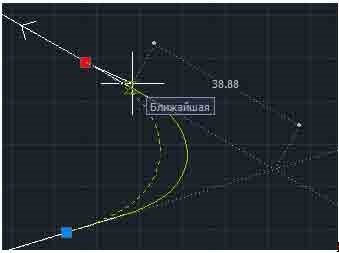
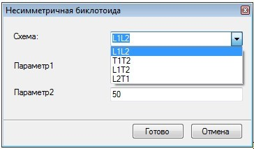
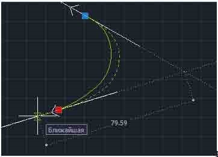

# Построение симметричной биклотоиды

Данные функции позволяют вписывать биклотоидную кривую по заданным параметрам.

Чтобы создать сопряжение с использованием биклотоиды, выберите элемент меню **Рисовать – Построения – Биклотоида**.

## Построение симметричной биклотоиды

Чтобы создать сопряжение с использованием симметричной биклотоиды:

1. Выберите элемент меню: **Рисовать – Построения – Биклотоида - Симметричная**.
2. Последовательно укажите левой кнопкой мыши первый и второй тангенс. Откроется диалоговое окно:

   

3. В поле схема выберите одну из схем построения закругления, в другом поле введите параметр закругления, соответствующий схеме. В программе возможны следующие схемы закругления:

* **Радиус** – построение по радиусу в точке сопряжения клотоид.
* **Биссектриса** – построение по величине биссектрисы угла.
* **Тангенс** – построение по величине тангенсов.
* **Длина** – построение по длине клотоиды.

   При использовании схемы **Тангенс** пользователь может изменять графически значение тангенса, перемещая мышкой точку сопряжения тангенса и клотоиды.

   

4. Для выхода из данной функции нажмите правую клавишу мыши или выберите **Готово**, для завершения работы команды нажмите **Отмена**.

## Построение несимметричной биклотоиды

Чтобы создать сопряжение с использованием несимметричной биклотоиды:

1. Выберите элемент меню **Рисовать – Построения – Биклотоида - Несимметричная**.
2. Последовательно укажите левой клавишей мыши первый и второй тангенс. Откроется диалоговое окно:

   

3. В поле схема выберите одну из схем построения закругления, в остальных полях введите параметры закругления, соответствующие схеме. В программе возможны следующие схемы закругления:

* **L1L2** – построение по длине первой и второй клотоиды.
* **T1T2** – построение по величине первого и второго тангенса.
* **L1T2** – построение по длине первой кривой и величине второго тангенса.
* **L2T1** – построение по длине второй кривой и величине первого тангенса.

   При использовании схем **T1T2, L1T2, L2T1** пользователь может изменять графически значение тангенса(ов), перемещая мышкой точку сопряжения тангенса и клотоиды.

   

4. Для выхода из данной функции нажмите правую клавишу мыши или выберите **Готово**, для завершения работы команды нажмите **Отмена**.
