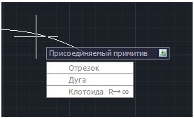
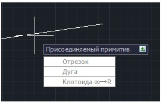
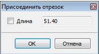
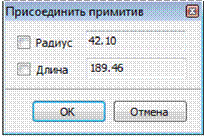
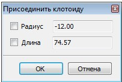
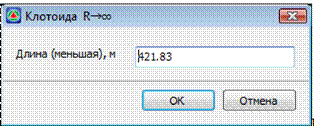

# Присоединение примитивов

Для присоединения одного элемента к другому выберите элемент меню: **Рисовать – Построения – Присоединить примитив**.



 Исходный объект (отрезок, дуга, клотоида, полилиния, трасса и пр.), к которому присоединяются остальные, должен быть отрисован предварительно.



Программа позволяет присоединить к элементу следующие примитивы: прямую, арку, прямую или обратную клотоиду, прямую или обратную усеченную клотоиду. Для этого:

1. Левой кнопкой мыши выберите объект, к которому необходимо добавить примитив.
2. При помощи графического курсора и привязок укажите левой кнопкой мыши точку на элементе, к которой необходимо присоединить новый элемент. Если выбранный примитив не был отрезком или полилинией, то появится контекстное меню:

   

   иначе появится контекстное меню:

   

3. Далее выполните одно из указанных действий:

   * Выберите пункт **Отрезок** для присоединения к элементу отрезка. На экране появится отрезок, соединяющий перекрестие курсора с выбранной точкой, и откроется диалоговое окно:

     

     Далее либо укажите левой кнопкой мыши точку конца отрезка (на этом построение примитива закончится), либо в окне **Присоединить отрезок** установите галочку в поле **Длина** и задайте длину отрезка. После чего с помощью мыши укажите направление отрезка на экране и нажмите левую клавишу мыши.
   * Выберите пункт **Дуга** для присоединения к элементу круговой кривой. При этом на экране появится арка, соединяющая перекрестие курсора с выбранной точкой, и откроется диалоговое окно:

     

     Далее либо укажите левой кнопкой мыши точку конца дуги (на этом построение примитива закончится), либо в окне **Присоединить примитив** задайте детальные параметры дуги. Установив галочки в поле **Радиус** и **Длина**, вы можете задать и зафиксировать соответствующие параметры дуги. Далее с помощью мыши укажите положение дуги на экране и нажмите левую клавишу мыши.

     

     1. Для изменения направления присоединяемой дуги нажмите пробел.
     2. При добавлении дуги к дуге или отрезку программа всегда будет сопрягать элементы в точке их присоединения.

     

   * Выберите пункт **Клотоида (∞→R)** для присоединения к элементу прямой клотоиды (кривизна меняется от бесконечности до заданного значения). При этом на экране появится клотоида, соединяющая перекрестие курсора с выбранной точкой, и откроется диалоговое окно:

     

     Далее либо укажите левой кнопкой мыши точку конца клотоиды (на этом построение примитива закончится), либо в окне **Присоединить клотоиду** задайте детальные параметры клотоиды. Установив галочки в поле **Радиус** и **Длина**, вы можете задать и зафиксировать длину клотоиды и радиус в конечной точке. Далее с помощью мыши укажите положение клотоиды на экране и нажмите левую клавишу мыши.
   * Выберите пункт **Клотоида (R→∞)** для присоединения к элементу обратной клотоиды (кривизна меняется от заданного значения до бесконечности). Откроется диалоговое окно:

     

   * Выберите пункт **Клотоида усеченная (Rб→Rм)** для присоединения к элементу.

     Введите длину обратной клотоиды и нажмите **ОК** (значение длины клотоиды должно быть меньше предложенного программой). Далее с помощью мыши укажите положение клотоиды на экране и нажмите левую клавишу мыши.

4. Для завершения команды нажмите правую клавишу мыши или **Esc**.
