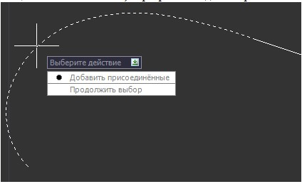
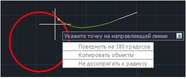
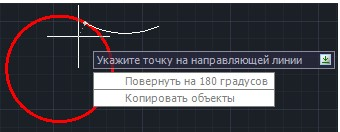

# Перемещение примитивов по касательной

Для того, чтобы переместить один примитив или группу примитивов по касательной:

1. Выберите элемент меню **Рисовать – Построения – Переместить по касательной**.
2. Затем укажите левой клавишей мыши базовый элемент (элемент, который будет перемещаться по касательной). Программа выдаст запрос:

   

   * Выберите **Добавить присоединенные** для автоматического выбора всех присоединенных к базовому элементу примитивов.
   * Выберите **Продолжить выбор** для выбора объектов для перемещения вручную, используя клавишу **Shift**. После выбора примитивов для их перемещения нажмите правую клавишу мыши.
3. Укажите левой кнопкой мыши направляющую, по касательной к которой будут перемещаться объекты. После выбора направляющей все объекты начинают перемещаться за курсором по касательной к направляющему примитиву. Программа сопрягает начальную или конечную точку базового элемента с направляющей.
4. Укажите левой кнопкой мыши требуемую точку на касательной.
5. Для задания дополнительных параметров сопряжения нажмите правую клавишу мыши или кнопку **↓** на клавиатуре. Если базовый элемент являлся клотоидой, то появится контекстное меню:

   

   иначе появится контекстное меню:

   

   * Выберите **Повернуть на 180 градусов** или нажмите клавишу **Пробел** для разворота перемещаемых объектов на 180 градусов.
   * Выберите **Копировать объекты** для того, чтобы программа перемещала по касательной копии выбранных элементов. При этом оригинал базового элемента не изменит своего положения.
   * Выберите **Не досопрягать к радиусу** в этом случае программа будет сопрягать базовый элемент с касательной к направляющему элементу. Если опция не выбрана, то программа всегда будет досопрягать клотоиду к радиусу на направляющем элементе (изменять параметры клотоиды таким образом, чтобы радиус в конечной точке был равен радиусу кривой на направляющем элементе).
