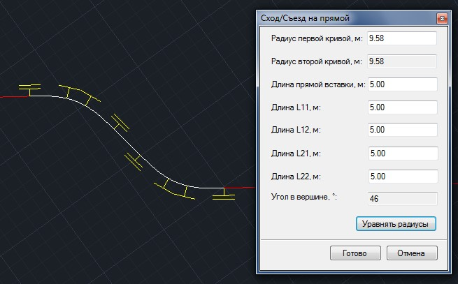
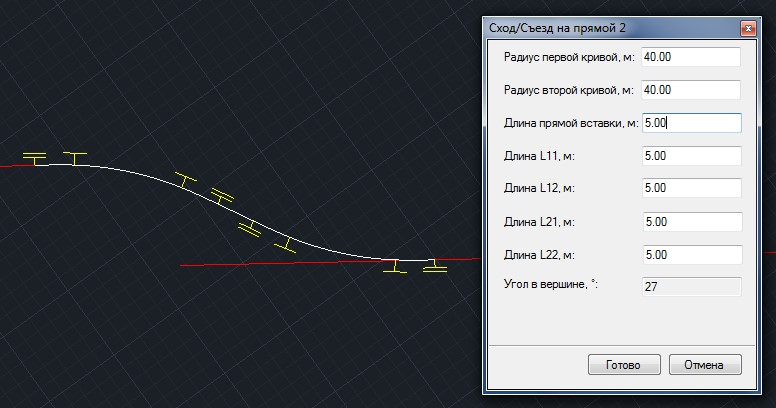
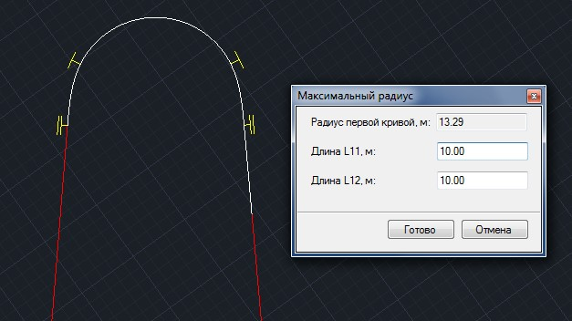
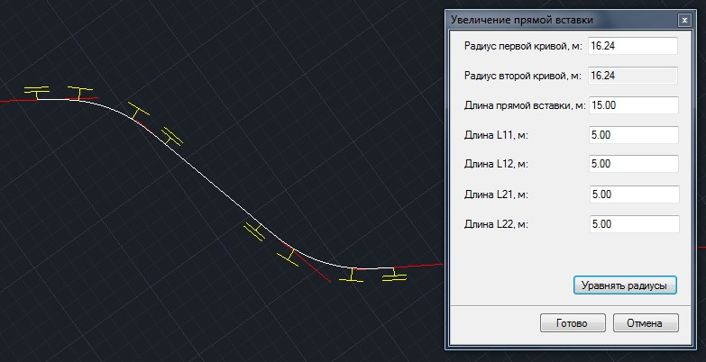
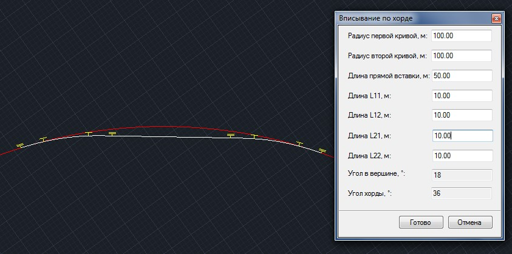
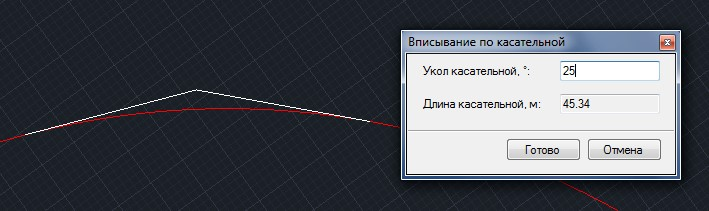

# Плановые построения

Данный блок функций также позволяет сопрягать элементы плана по заданным схемам, которые могут быть использованы при проектировании железнодорожных съездов.

Чтобы воспользоваться одной из схем сопряжения:

1. Выберите элемент меню **Рисовать - Построения – Оптимизация плана - ...**, далее выберите схему, по которой необходимо выполнить сопряжения элементов.
2. Последовательно укажите левой кнопкой мыши первый и второй исходный примитив, которые необходимо сопрячь.
3. В появившемся диалоговом окне задайте параметры сопрягаемых элементов и нажмите **Готово**.

В результате программа выполнит сопряжение элементов по заданной схеме.

Основные схемы сопряжений перечислены ниже:

## Сход/Съезд

Данный тип сопряжения позволяет сопрячь конец первого пути с началом второго пути:



 Данное сопряжение чувствительно к направлению исходных отрезков. Отрезки должны располагаться так, чтобы конец первого отрезка при сопряжении присоединялся к началу второго отрезка.



## Сход/Съезд2

Данный тип сопряжения позволяет сопрячь конец первого пути с произвольной точкой на отрезке второго пути. Точка сопряжения на отрезке второго пути получается расчетом по параметрам, заданным пользователем:



Данное сопряжение чувствительно к направлению отрезков. Отрезки должны располагаться так, чтобы конец первого отрезка при сопряжении присоединялся к началу второго отрезка.



## Максимальный радиус

Данный тип сопряжения позволяет вписать максимально возможное закругление между двумя непараллельными отрезками. Программа будет подбирать параметры таким образом, чтобы закругление стыковалась с концом одного из отрезков, второй отрезок будет автоматически удлиняться:

### Фиксированная прямая вставка

Данный тип сопряжения позволяет сделать **Сход/Съезд**, задав его тремя отрезками. Параметры сопряжения задаются пользователем:

### Вписывание по хорде

Данный тип сопряжения позволяет сделать спрямление по хорде на кривой для устройства стрелочного перевода. Параметры спрямления задаются пользователем:

### Вписывание по касательной

Данный тип сопряжения позволяет сделать спрямление по касательной на кривой для устройства стрелочного перевода. Параметры спрямления задаются пользователем:

