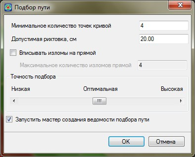
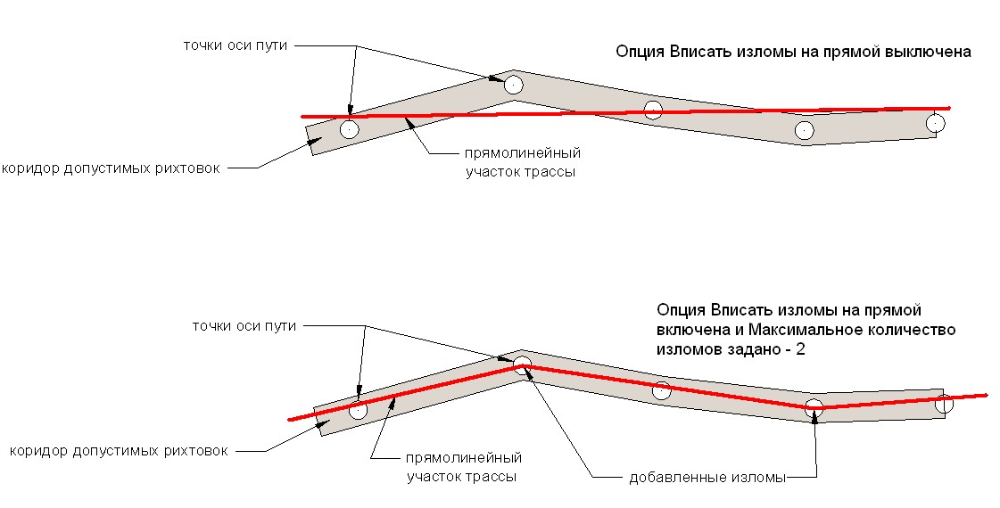

# Подбор оси

Данная функция позволяет автоматически подбирать параметры плана трассы (круговые и прямолинейные участки). Исходным объектом для подбора может быть любой линейный объект: полилиния, структурная линия, трасса и т.п.



 Данная функция доступна при работе с моделями типа **Трассы** и **[Железные дороги](../../../rail/index.yaml)**.



Для подбора первого приближения:

1. Предварительно создайте новую трассу или сделайте текущей ту, параметры которой должны быть рассчитаны на основе исходного линейного объекта.

2. Выберите элемент меню **Задачи - Рихтовки – Подобрать первое приближение пути**, курсор примет форму прицела.

3. Левой кнопкой мыши укажите исходный объект, откроется диалоговое окно:

   

   В данном окне задаются следующие параметры подбора оси:

   **Минимальное количество точек кривой** – задайте минимальное количество точек, которое будет определять наличие кривой на участке трассы. Т.е. участок, на котором будет меньше точек, чем задано в данном поле, за кривую считаться не будет.

   **Допустимая рихтовка, см** – в данном поле ввода укажите допустимую величину смещения подбираемой трассы относительно исходной.

   

   При подборе пути программа стремится подобрать его таким образом, чтобы значения величины допустимой рихтовки были не больше заданного значения.

   

   **Вписать изломы на прямой** – при установлении опции **Вписать изломы** необходимо указать, какое максимальное количество точек перелома может быть вписано на прямолинейном участке трассы:

   

   **Точность подбора** – перемещая ползунок, выберите необходимую точность подбора элементов пути.

   

   Наиболее верные результаты подбора пути получаются при нахождении ползунка в зоне **Оптимальной точности**. При установлении более высокой точности подбора пути он будет произведен с минимальными значениями рихтовок. Однако количество элементов плана будет больше, чем при подборе с низкой точностью.

   

4. **Запустить мастер создания ведомости подбора пути** - при включении данной опции, после нажатия кнопки **ОК** в окне **Подбора пути**, будет запущен мастер создания ведомости.

5. Задайте все необходимые параметры и нажмите **Ок**.

В результате программа подберет первое приближение параметров оси. Для ее дальнейшего редактирования доступен весь функционал, который был описан выше, в данном разделе.

Также редактирование первого приближения удобно осуществлять с помощью графика кривизны. Блок функций по работе с графиком кривизны описан в **[Выправка пути](../../../rail/rail_tasks/straightening_way/selection_axis.md)**.
