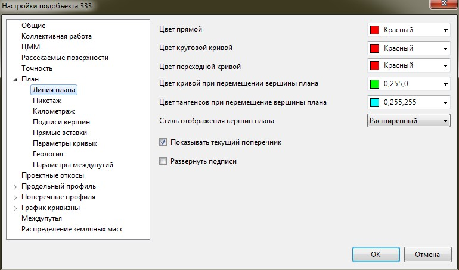

# Настройки отображения трассы

Все элементы трассы располагаются в соответствующих слоях. Соответственно, для редактирования их свойств (таких как видимость, цвет, активность) достаточно воспользоваться менеджером слоев, расположенным на стандартной панели:

Также отображение/представление элементов плана задаются в окне настроек. Для их изменения:

1. В **Структуре проекта** на необходимой модели **подобъекта** нажмите правой кнопкой мыши, выберите пункт **Настройки**.
2. Разверните двойным щелчком левой кнопки мыши дерево элементов заданной модели (трассы) и измените необходимые настройки:

   

3. На вкладке **Линия плана** задаются настройки цвета линии плана. В соответствующих селекторах имеется возможность задать отдельно для каждого элемента плана свой цвет, а также цвет кривой и тангенсов при перемещении вершины угла:

   
   
4. Для выхода из окна настроек программы нажмите **ОК**.



 В данном окне задаются настройки текущей модели **Трассы**. Для задания настроек по умолчанию для вновь создаваемых моделей, а также для общих настроек проекта, воспользуйтесь элементом меню **Сервис - Настройки**.


