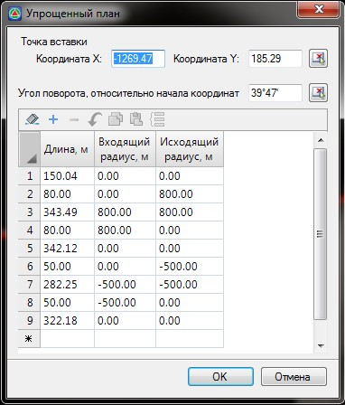

# Упрощенный план

Данная функция позволяет поэлементно задавать план трассы в табличном виде. Функцию удобно использовать, когда необходимо создать трассу по параметрам, имеющимся в ведомости или на развернутом плане (в шапке продольного профиля).

Для вызова данной функции выберите элемент меню **План – Упрощенный план**. Откроется диалоговое окно:

**Точка вставки**: В данных полях можно задать координаты начальной точки трассы.

**Угол поворота**: В данном поле можно задать угол поворота начального элемента трассы (касательной к начальной точки трассы) относительно горизонтальной оси.

* Для элемента прямая задается только параметр **Длина**, а поля **Входящий** и **Исходящий радиус** должны иметь нулевые значения.
* Для элемента круговая кривая задается параметр **Длина**, а также **Входящий** и **Исходящий радиус**. Значение входящего и исходящего радиуса должно быть одинаковым. Если радиус имеет отрицательное значение, то кривая направлена по ходу пикетажа в левую сторону, а если положительное - в правую.
* Для элемента переходная кривая задается параметр **Длина**, а также **Входящий** и **Исходящий радиус**. Значение входящего и исходящего радиуса должно быть разным. Для элемента **полная клотоида** одно из значений радиусов должно быть нулевым. Для элемента **усеченная клотоида** значения радиусов должны также быть различными и не нулевыми.

Если радиус имеет отрицательное значение, то клотоида направлена по ходу пикетажа в левую сторону, а если положительное - в правую.
