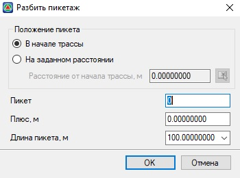
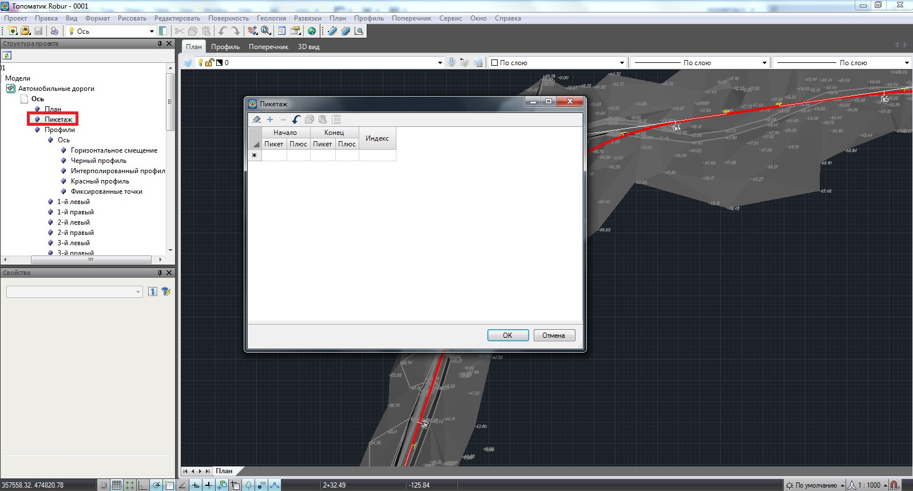
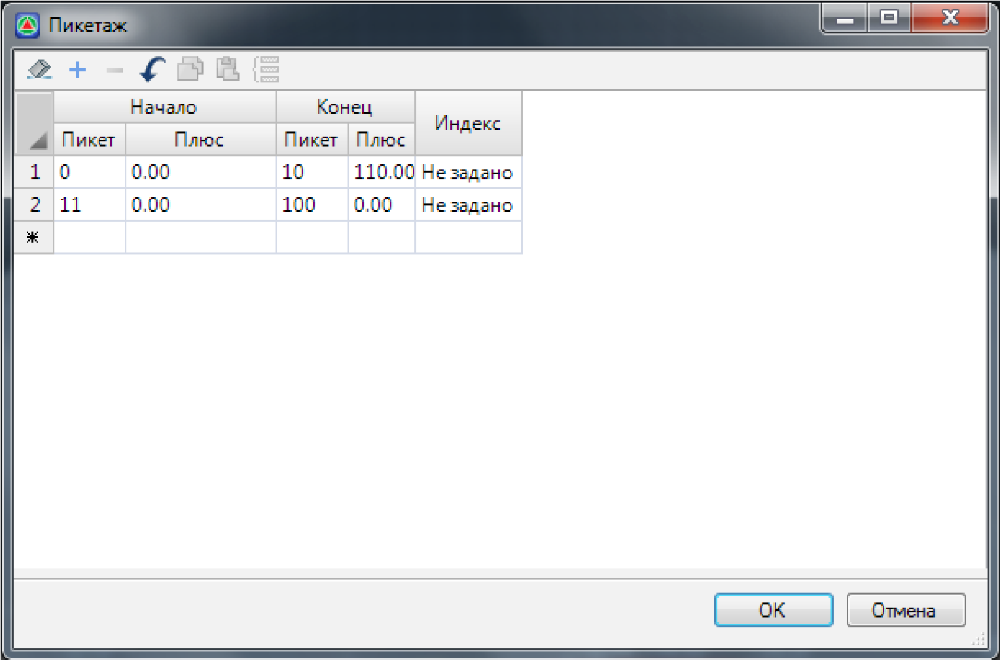
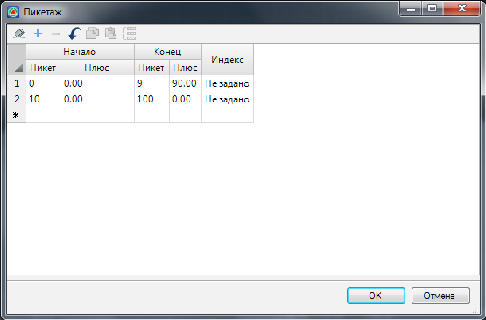

# Разбивка пикетажа

При создании трассы **Robur** автоматически производит разбивку пикетажа. Однако если требуется произвести разбивку не с нулевого пикета, необходимо вручную обозначить начальный пикет. Для этого:

1. Выберите элемент меню **План – Разбить пикетаж**. Появится диалоговое окно:

   

2. Введите начальный пикет, начальный километраж, длину пикета и выберите **ОК**. Программа автоматически разобьет пикетаж.

Также для случая, при котором имеются рубленые пикеты, предусматривается разбивка пикетажа. Для этого:

1. В дереве структуры проекта откройте двойным щелчком левой кнопки мыши таблицу пикетажа соответствующей трассы:

   

   Каждая строка таблицы соответствует участку непрерывного пикетажа. Если расстояние до начала участка меньше, чем расстояние до конца, то пикетаж на этом участке будет возрастать, иначе – убывать. Начальный номер пикета соответствует номеру пикета начала непрерывного участка. Индекс участка позволяет задавать имена пикетов в виде 1а, 1б, 1в во избежание дублирования имен пикетов.

   Резаные пикеты задаются путем введения дополнительного участка, примеры задания пикета длиной более и менее 100 метров представлены ниже.

   #|
   ||  |  ||
   || Пример задания пикета длиной более 100 метров | Пример задания пикета длиной менее 100 метров ||
   |#

2. Заполните таблицу и нажмите кнопку **ОК**.

В результате программа переопределит пикетаж и обозначит рубленые пикеты там, где они были заданы.
