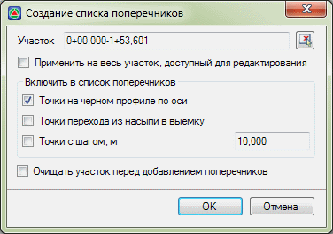

# Создание списка поперечников

Если текущей трассе была назначена поверхность черной земли, то поперечные профили будут формироваться непосредственно по этой поверхности. Процедура выбора данной поверхности была описана выше, в разделе **Черный профиль**.

Список поперечников содержит набор пикетажных значений, на которых должны быть сформированы поперечные профили.

1. Для создания списка поперечников выберите элемент меню **Поперечник – Создать список поперечников**. Появится диалоговое окно:

   

   В поле участок можно задать пикеты границ участка, в пределах которого надо формировать поперечники. Для этого необходимо предварительно отключить опцию **Применить на весь участок доступный для редактирования**. Также участок можно выбрать визуально в окне План. Для этого нажмите кнопку  и последовательно укажите начало и конец участка.

   Для создания списка в поле **Включить в список поперечников** можно установить следующие настройки:

   **Точки на черном профиле по оси** – включает в список поперечников пикеты ординат черного профиля трассы.

   **Точки с шагом** – включает в список поперечники, расположенные с заданным шагом от целых пикетов.

   **Очищать участок перед добавлением поперечников** – если при создании списка поперечников данная опция включена, то на заданном участке программа удалит поперечники и добавит новые. Если опция выключена, то на выбранном участке программа добавит поперечники, не удаляя существующие.

2. Установите необходимые настройки формирования списка поперечников и нажмите кнопку **ОК**.



1. Данная функция только создает список пикетов, на которых будут поперечники.
2. Отметки и смещения точек черных поперечников вычисляются динамически по следующему алгоритму. Проверяется, есть ли данные для черного поперечника в таблице черных поперечников на конкретном пикете. Если есть, то эти данные используются для построения поперечника. Если нет, то черный поперечник снимается непосредственно с цифровой модели рельефа. Процедура работы с таблицей поперечников будет описана ниже.


