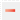

# Редактирование черных поперечников

Как отмечалось выше, в **Robur** предусмотрена специальная таблица, называемая **Черные поперечники**, в которой могут быть помещены смещения и отметки точек черного поперечника на конкретном пикете.

Наличие этой таблицы позволяет решить две задачи:

* Редактирование черного поперечника, без изменения цифровой модели рельефа.
* Создание черных поперечников без использования цифровой модели рельефа.

Для редактирования текущего черного поперечника выполните следующие действия:

1. Выберите элемент меню **Поперечник - Редактировать черный поперечник**. Откроется окно:

   

2. По умолчанию данные в таблице недоступны для редактирования, т.к. предполагается, что поперечные профили должны формироваться по поверхности земли. Для редактирования данной таблицы отключите опцию **Динамический поперечник**.
3. Отредактируйте данные и нажмите кнопку **OK**.

* Для вставки пустой строки нажмите одновременно клавиши **Ctrl+Enter** или выберите кнопку на панели инструментов  .
* Для удаления строки нажмите клавиши **Ctrl+Y** или выберите кнопку на панели инструментов  .
* Для удаления данных всей таблицы выберите кнопку на панели инструментов  .
* Для копирования выбранной строки таблицы в буфер обмена выберите кнопку на панели инструментов  .
* Для вставки значений ранее скопированной строки из буфера обмена выберите кнопку на панели инструментов  .
* Для вставки строки с интерполированным значением выберите кнопку на панели инструментов  .
* Для отмены ранее выполненного действия выберите кнопку на панели инструментов  .
* Смещения в таблице должны быть заданы в порядке возрастания.



 Следует иметь в виду, что при заполнении данных поперечника через  таблицу, в дальнейшем всегда будут использоваться именно эти значения, а не динамические данные, получаемые по цифровой модели рельефа. Т.е., к примеру, изменения плановой геометрии или поверхности рельефа не отобразятся на тех поперечниках, которые были заполнены или отредактированы табличным способом.



Вышеописанная таблица содержит данные только текущего поперечного профиля. Для групповой работы с черными поперечными профилями можно воспользоваться окном **Структура проекта**:

1. С помощью меню **Вид-Структура проекта** откройте данное окно.
2. В дереве проекта раскройте набор таблиц, относящихся к редактируемой трассе и дважды щелкните левой кнопкой мыши по таблице **Черные поперечники**. Откроется следующее окно:

   .

В левой части данного окна показан полный список поперечных профилей, которые содержит текущая трасса. Поперечникам, которые подлежали ручному редактированию в колонке **Динамический**, должен соответствовать признак **Нет**.

Принцип редактирования поперечных профилей через данное окно аналогичен редактированию текущего поперечника, что было описано выше.

Чтобы отменить табличное редактирование поперечного профиля и привести его в соответствие с данными **ЦММ**, необходимо включить опцию **Динамический поперечник**. Чтобы сделать это для всех поперечников, нажмите кнопку **Все динамические**. После выбора данной опции для всех поперечных профилей в колонке **Динамический** должен быть установлен признак **Да**.
