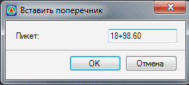
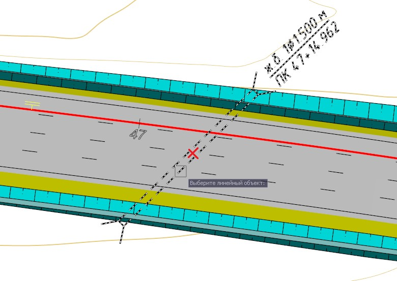
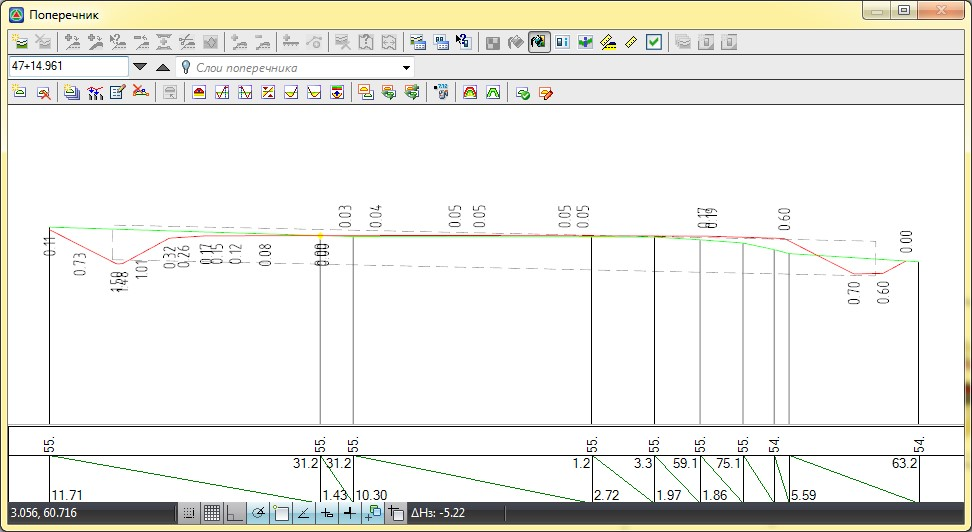

# Вставка дополнительных поперечников

Данная группа функций позволяет добавлять поперечники к списку по характерным элементам трассы. Для этого выберите элемент меню **Поперечник – Вставить поперечник по - ...**. Далее рассмотрим каждую из этих функций.

## Вставка поперечников по плану

Данная функция позволяет добавлять поперечники к списку непосредственным указанием его местоположения в окне **План**. Для этого:

1. Выберите элемент меню **Поперечник – Вставить поперечник по – По плану**.
2. В окне **План**, перемещаясь курсором вдоль трассы, щелкните левой кнопкой мыши в том месте, где необходимо добавить поперечник. Появится следующие диалоговое окно:

   

3. В появившемся диалоговом окне уточните значение пикета, на котором должен быть вставлен поперечный профиль, и нажмите **ОК**.

## Вставка поперечников по заданным пикетам

Функция предназначена для создания поперечников по съемочным точкам (точкам поверхности). В данном случае поперечники формируются не по ребрам поверхности, а именно по точкам, расположенным на заданных пикетах.

Для этого необходимо выполнить следующие действия:

1. Выберите пункт меню **Поперечники - Вставить поперечники по - По заданным пикетам**. Откроется диалоговое окно:

   

2. В поле **Участок, ПК** задайте пикет начала и конца участка, на котором будут строиться поперечники.
   * Установите опцию **Целые пикеты** для формирования поперечников по точкам, расположенным на целых пикетах.
   * Установите опцию **Плюсы с шагом, м**, если необходимо, чтобы по точкам формировались поперечники, расположенные с заданным шагом от целых пикетов.
   * Установите опцию **Включать границы участка**, если необходимо включить точки начала и конца текущего участка, лежащие не на целых пикетах.
   * Отметьте флаг **Включать пикеты** и введите значения **Пикет плюс через «;»**, если необходимо сформировать характерные поперечные профили по точкам, которые не попадают на целые значения пикетов или на шаг между пикетами.
3. Нажмите кнопку **ОК.**

В результате на выбранных пикетах по точкам поверхности будут сформированы поперечные профили.



 Если в заданной точке нет съемочных точек, поперечник построен не будет. Принадлежность точек поперечнику определяется исходя из их нахождения относительно области принадлежности. Если точка лежит внутри области принадлежности к поперечнику, она автоматически проецируется на поперечник:
 
 
 
 Значения **L** задаются в окне **Свойств** подобъекта на вкладке **ЦММ** (Ширина полосы съемки поперечников), угол между гипотенузой треугольника и осью поперечника по умолчанию равен 5˚. Для изменения данных настроек (ширины полосы поиска и угла достоверности) воспользуйтесь вкладкой **Настройки**.



## Вставка поперечников по точкам поверхности

Функция предназначена для создания поперечников по точкам поверхности по заданному сечению.

Для этого:

1. Выберите меню **Поперечник - Вставить поперечники по - По точкам поверхности**, курсор примет форму прицела, задайте линию сечения, указав начальную и конечную точки.

   

   Зажав клавишу **Ctrl** и вращая колесико мыши в ту или иную сторону, можно изменить ширину коридора отбора точек.

   

   Откроется диалоговое окно:

   

2. При необходимости уточните пикет и нажмите **Ок**. В результате программа создаст поперечник на соответствующем пикете по точкам, которые попали в заданный коридор для отбора точек.

## Вставка поперечников по сечению

Функция предназначена для создания косых поперечных профилей. Сечения создаются на основе пересекаемых трассу коммуникаций, водопропускных труб или произвольных линейных контуров. Они сохраняются в общем списке поперечников, а для их редактирования или формирования чертежей доступен стандартный инструментарий по работе с поперечными профилями. Положение водопропускных труб отображается на поперечниках.

Для создания «косого» сечения:

1. Выберите меню **Поперечник – Вставить поперечники по - По сечению**, курсор примет форму прицела, укажите линейный объект:

   

2. В результате в общий список поперечников будет добавлено и открыто для просмотра в окне **Поперечник** созданное «косое» сечение, и если оно создавалось по водопропускной трубе, то отобразится соответствующий условный знак:

   



 Для редактирования и создания чертежа «косого» сечения используется стандартный функционал работы с черным поперечником.


