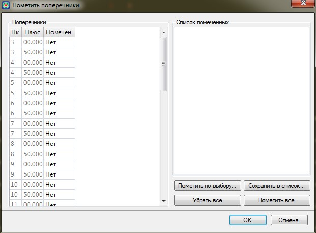
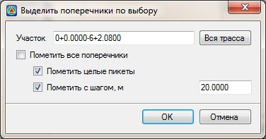
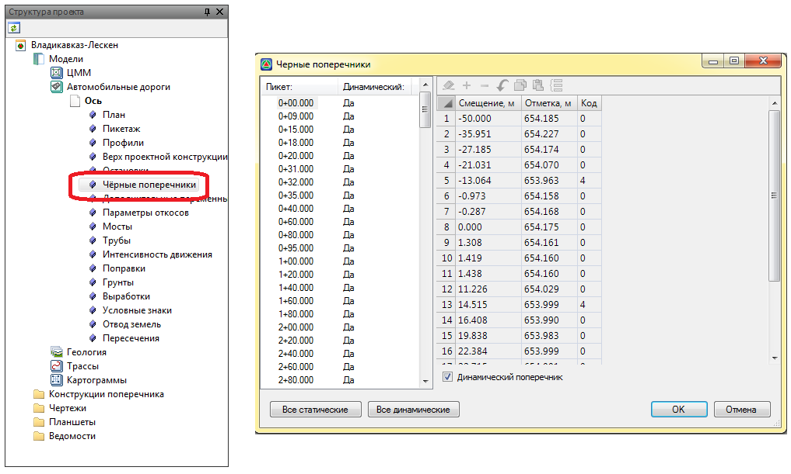

# Пометить поперечники

С помощью данной функции удобно помечать группу поперечников, расположенных на заданном участке или находящихся на определённом фиксированном расстоянии друг от друга. В дальнейшем с помеченными поперечниками могут быть выполнены какие-либо действия (удаление, создание чертежа и т.п.). Набор помеченных поперечников может быть сохранен в именованный список.

Чтобы воспользоваться данной функцией:

1. Выберите меню **Поперечник - Пометить поперечники**, откроется диалоговое окно:

   

   * Чтобы пометить выборочно какие-либо поперечники из списка, выберите параметр **Да** в столбце **Помечен**, напротив соответствующего пикета.
   * Чтобы выделить все поперечники в данном списке, нажмите кнопку **Пометить все**.
   * Чтобы отменить выделение поперечников для всего списка, нажмите кнопку **Убрать все**.
   * Чтобы автоматически выделить поперечники с заданным шагом, нажмите кнопку **Пометить по выбору**, откроется диалоговое окно:
   
     

     В поле **Участок** можно указать пикеты границ выбора поперечников. Чтобы выбор происходил по всему списку поперечников, нажмите кнопку **Вся трасса**.
     * Чтобы пометить все поперечники на выбранном участке, установите опцию **Пометить все поперечники**.
     * Чтобы пометить только поперечники на целых пикетах и плюсах в пределах данного участка, установите соответствующие опции.
   * С помощью опции **Сохранить в список** можно сохранить помеченные поперечники в именованный список. Для этого:
     
     a. Отметьте необходимые поперечники с помощью имеющихся опций.

     b. Нажмите кнопку **Сохранить в список**, откроется диалоговое окно:
     
        

     c. Введите имя списка и нажмите **ОК**. В результате будет создан новый именованный список. Списки активируются при двойном нажатии на них левой кнопкой мыши.
2. По завершении необходимых настроек нажмите **Ок**.
