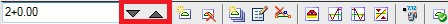
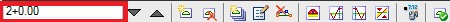

# Перемещение по списку поперечников

**Robur** позволяет последовательно просматривать и редактировать поперечные профили. Для перемещения по списку поперечников, то есть для выбора текущего поперечника, можно пользоваться следующими способами:

1. При помощи клавиш:
   * **Page Up** – следующий поперечник.
   * **Page Down** – предыдущий поперечник.
   * **Home** – последний поперечник.
   * **End** – первый поперечник.
2. При помощи кнопок на панели инструментов в окне **Поперечник**:

   

3. Выбор текущего поперечника и группы поперечников осуществляется при помощи **_селектора поперечников_**, расположенного на панели инструментов в окне **Поперечник**:

   

   Печатайте в селекторе поперечников требуемый пикет. Если поперечника на указанном пикете нет в списке поперечников, то текущим становится ближайший по ходу возрастания пикетажа к указанному.
