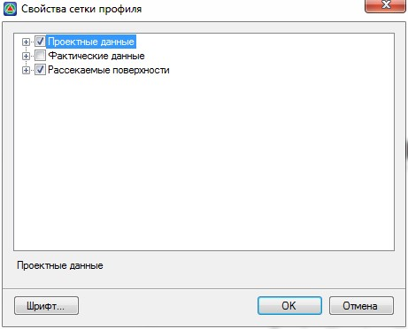

# Настройка отображаемых данных в сетке поперечника

В окне **Поперечник** можно настраивать масштаб его отображения, размеры подписей, а также типы данных, которые должны отображаться в шапке поперечного профиля.

Для включения менеджера сетки профиля необходимо выполнить следующие действия:

1. Щелкните правой кнопкой мыши по шапке поперечного профиля и выберите из появившегося контекстного меню пункт **Свойства панели**, откроется диалоговое окно:

   
   
2. В открывшемся окне отметьте галочками те данные, которые должны быть отображены в шапке профиля и нажмите **ОК**.
