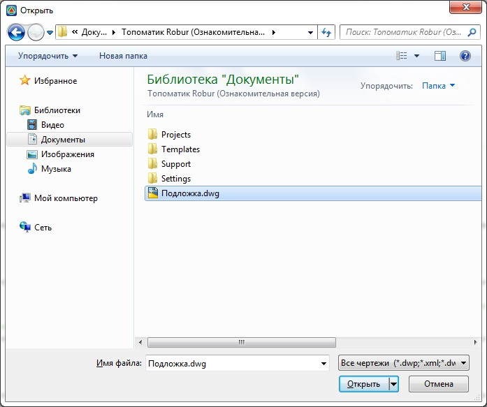

# Векторные подложки на поперечнике

Данная функция позволяет на текущий поперечный профиль в виде подложки импортировать файлы чертежей. К примеру, данный механизм может быть полезен для подгрузки чертежей геологических подложек, коммуникаций и т.п. Для этого:

1. Выберите меню **Поперечник – Векторная подложка - Вставить**, откроется диалоговое окно:

   
   
2. Выберите файл подложки, который необходимо подгрузить, и нажмите **Открыть**. В результате файл в виде подложки отобразится на текущем поперечнике.



 Перед добавлением векторной подложки из данного чертежа рекомендуется заранее исключить все лишние слои, назначить контурам соответствующие цвета и т.п., т.к. данная функция предусматривает только подгрузку чертежа, но не предусматривает его дальнейшее редактирование. Для удаления векторной подложки выберите элемент меню **Поперечник - Векторная подложка-Удалить**.


