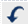
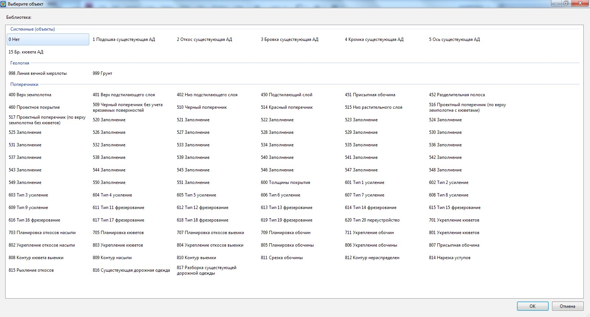

# Визуальное редактирование черных поперечников

Табличный способ редактирования черных поперечников является наиболее универсальным.

Однако ряд простых операций, таких как удаление лишних точек или изменение их кодов, можно производить визуальным способом.

## Удалить точку на черном поперечнике

* Для удаления лишних точек с текущего поперечного профиля:

  1. Выберите элемент меню **Поперечник - Удалить точку на черном поперечнике**. Курсор примет форму прицела.
  2. Левой кнопкой мыши последовательно укажите точки, которые необходимо удалить.
  3. Для выхода из режима удаления точек нажмите правую кнопку мыши. Из открывшегося контекстного меню выберите пункт **Завершить**.

При необходимости для отмены удаления последней точки или группы точек воспользуйтесь кнопкой **Отменить** , расположенной на стандартной панели.

## Назначить код точки

* Для визуального изменения кодов точек поперечного профиля:
  1. Выберите элемент меню **Поперечник – Назначить код точки**.
  2. Курсор примет форму прицела. Левой кнопкой мыши выберите на поперечном профиле точку, которой необходимо назначить код. Откроется окно кодификатора:
  
     

  3. Выберите в данном списке семантический код, который нужно назначить выбранной точке, и нажмите **ОК**.
