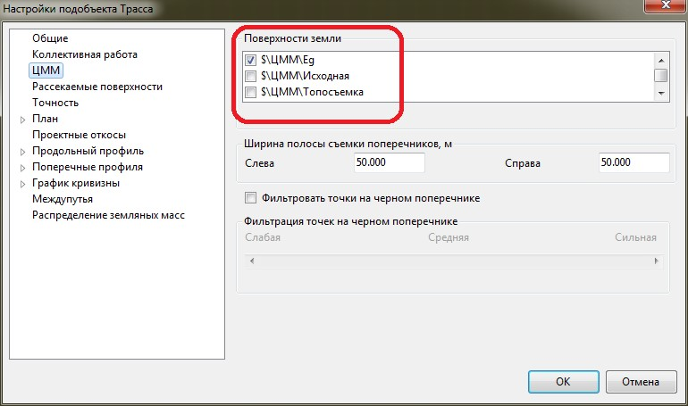
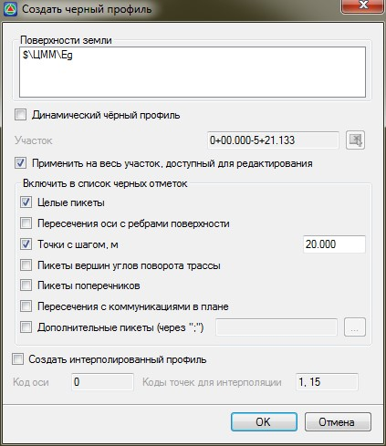

# Создание черного профиля

Для формирования черного профиля помимо трассы проект должен содержать хотя бы одну предварительно построенную поверхность. Если же проект содержит несколько поверхностей, то необходимо уточнить, какая из них должна считаться “**черной землей**”, по которой по умолчанию будет формироваться черный профиль.

Для этого:

1. В дереве **Структуры проекта** щелкните правой кнопкой мыши по соответствующему наименованию трассы и выберите из появившегося контекстного меню пункт **Настройки**. Откроется окно **Настроек подобъекта**.
2. В данном окне перейдите на вкладку **ЦММ**.
3. В поле **Поверхность** земли поставьте галку напротив той поверхности, по которой должны формироваться черные профили и сечения:

   

4. Нажмите **ОК**.

   

   Ширина полосы съемки поперечников может задаваться в тех случаях, когда в качестве **ЦММ** используются очень большие поверхности и поперечные профили по оси должны формироваться не на всю ширину съемки, а лишь в определенном коридоре трассы.

   

Для создания черного профиля:

1. Выберите элемент меню **Профиль – Создать черный профиль**. Откроется диалоговое окно:

   

   В информационном поле **Поверхность** земли должно быть указано наименование поверхности, по которой будет генерироваться профиль.

   Включение опции **Динамический продольный профиль** позволяет при изменении положения плана автоматически перестраивать черный продольный профиль и пересчитывать пикетажные положения пересекающих ось коммуникаций.

   По умолчанию при открытии данного окна предлагается создать профиль на всем протяжении трассы.

   В поле участок можно задать пикеты границ участка, в пределах которого надо построить или перестроить профиль. Для этого необходимо предварительно отключить опцию **Применить на всю трассу**. Участок, на котором необходимо создать продольный профиль, можно также выбрать визуально. Для этого нажмите кнопку , курсор примет форму прицела, после чего в окне **Профиль** выберите секущей рамкой область, в которой должен быть создан продольный профиль.

   Имеется возможность задать комбинацию методов сканирования поверхности установкой соответствующих опций в поле **Включить в список черных отметок**:

   * **Целые пикеты** – вычисляются отметки на целых пикетах.
   * **Пересечение оси с ребрами поверхности** – вычисляются отметки в точках пересечения оси дороги с ребрами поверхности. Этот метод учитывает все особенности рельефа, но при его использовании образуется много избыточных точек в профиле.
   * **Точки с шагом** – вычисляются отметки в точках поверхности с заданным шагом вдоль оси трассы.
   * **Пикеты вершин углов поворота трассы** – вычисляются отметки на пикетах вершин углов поворота трассы.
   * **Пикеты поперечников** - вычисляются отметки по оси черных поперечников. Этот режим, как правило, предусмотрен для случаев, когда производилось корректирование отдельных черных поперечников, а модель рельефа не изменялась и необходимо привести профиль в соответствие с поперечниками.
   * **Пересечения с коммуникациями в плане** – вычисляются отметки в точках пересечения оси дороги и линейными объектами.
   * **Дополнительные пикеты** – включив данную опцию, можно заполнить таблицу дополнительных пикетов, в которых будут вычислены отметки черного профиля.
   * Опция **Создать интерполированный профиль** позволяет сформировать дополнительную линию, построенную по данным интерполированной земли, определяемую поперечными профилями трассы. Процедура построения интерполированного профиля будет описана [далее](create_interpolated_profile.md).

2. Установите необходимые настройки и нажмите кнопку **ОК**.

В результате программа построит черный продольный профиль трассы и отобразит его в соответствующем окне.
