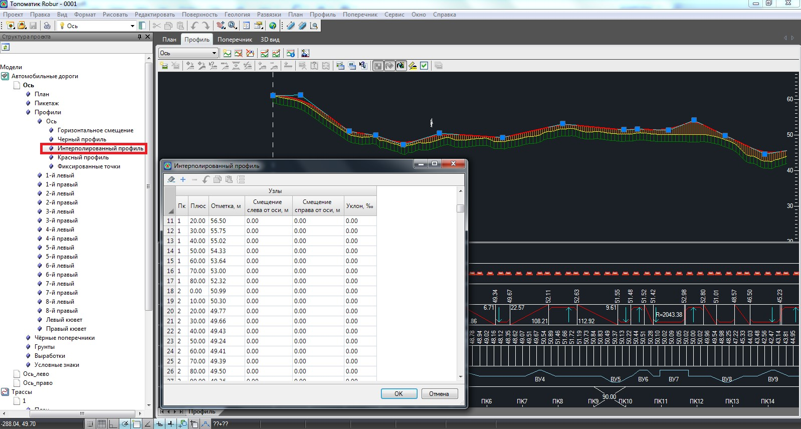

# Создание интерполированного профиля

Данная функция отрисовывает линию интерполированного профиля в окне **Профиль** и линию интерполированной земли в окне **Поперечник**. Отметка на профиле определяется интерполяцией между двумя точками поперечника с заданными семантическими кодами.

Для создания интерполированного черного профиля выполните следующие действия:

1. Воспользуйтесь элементом меню **Профиль - Создать интерполированный профиль**. Появится диалоговое окно:

   

2. Укажите код существующей оси, коды точек для интерполяции и щелкните на кнопке **OK**. Программа автоматически построит линию интерполированного профиля в окне **Профиль** и линию интерполированной земли в окне **Поперечник**, если они были созданы.

Интерполированный профиль аналогично черному профилю и другим элементам трассы хранится в специальной таблице и доступен для редактирования табличным способом.

Таблицу **интерполированного профиля** можно открыть, воспользовавшись деревом структуры проекта:

Первые три столбца данной таблицы описывают положение линии интерполированной земли на продольном профиле, а последние три – на поперечниках.
