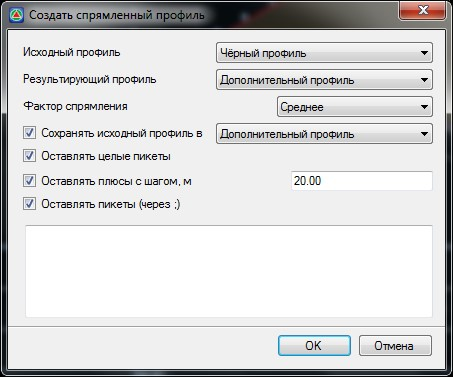

# Создание спрямленного профиля

Спрямление профиля заключается в замене ряда смежных, коротких и близких по крутизне элементов исходного существующего профиля пути, одним элементом эквивалентной крутизны и длиной, равной суммарной длине спрямляемых элементов.

* **Данная функция доступна при работе с моделями типа [Железные дороги](../../../rail/index.yaml).**

Для этого:

1. Выберите меню **Профиль - Спрямленный профиль**, откроется диалоговое окно:

   

   **Исходный профиль** - в данном поле в выпадающем списке выбирается профиль, по которому будет производиться спрямление.

   **Результирующий профиль** - в данном поле в выпадающем списке выбирается профиль, в котором будут сохранены результаты применения функции спрямления.

   **Фактор спрямления** - выберите один из трех факторов спрямления. Выбор сильного фактора спрямления приведет к созданию более спрямленного профиля, т.е. большее количество смежных элементов исходного профиля будет заменено одним элементом эквивалентной крутизны. Выбор слабого фактора спрямления приведет к созданию более ломаного профиля, состоящего из большего числа элементов.

   **Сохранять исходный профиль** - включение данной опции позволяет дополнительно продублировать исходный профиль, сохранив его в какой-либо выбранный из выпадающего списка.

   **Оставлять целые пикеты, Плюсы с шагом, Пикеты (через .)** - включение дополнительных настроек спрямления профиля, при которых указанные точки остаются неизменными при спрямлении.

2. Установите необходимые настройки создания спрямленного профиля и нажмите **ОК**.
