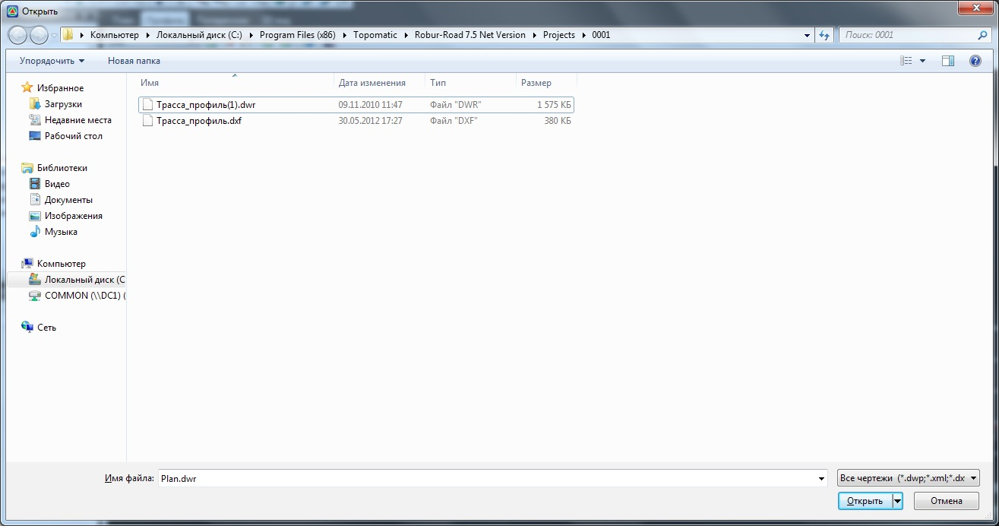

# Загрузка подложек на продольный профиль

Данная функция позволяет импортировать **dxf – чертежи** и отображать их в окне **Профиль**. К примеру, данный механизм может быть полезен для подгрузки чертежей геологических подложек, коммуникаций и т.п. Для этого:

1. Выберите меню: **Профиль – Векторная подложка - Вставить**, откроется диалоговое окно:

   
   
2. Выберите **DXF – файл** подложки, которую необходимо подгрузить и нажмите **Открыть**.
3. Откроется окно добавления подложки, в котором нужно точно указать начальную и конечную точку линии черного профиля (на чертеже). По этим двум точкам чертежа подложка будет привязываться и выравниваться в окне **Профиль**.

   После указания второй точки на подложке она будет подгружена в программу и отобразится в окне **Профиль**.



 При добавлении подложки необходимо следить, чтобы отношение ее вертикального масштаба к горизонтальному (соотношение масштабов в чертеже) совпадало с отношением масштабов профиля, отображаемого в программе.



При добавлении подложки на профиль из данного чертежа рекомендуется заранее выключить все лишние слои, назначить контурам соответствующие цвета и т.п., т.к. данная функция предусматривает только подгрузку чертежа, но не предусматривает его дальнейшее редактирование. Для удаления **dxf - подложки** из окна **Профиль** выберите элемент меню **Профиль - Векторная подложка - Удалить**.
