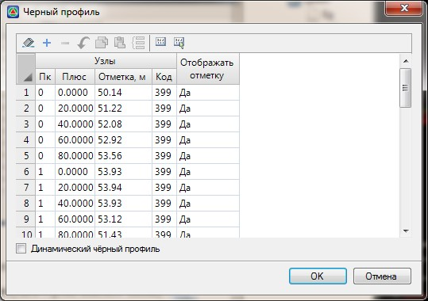
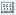
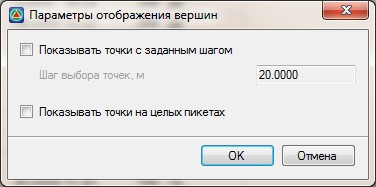
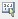

# Редактирование черного профиля

В **Robur** предусмотрена специальная таблица, называемая **Черный профиль**. Наличие этой таблицы позволяет решить две задачи:

* Редактирование черного профиля без изменения цифровой модели рельефа.
* Создание черного профиля без использования цифровой модели рельефа.

Для редактирования черного профиля табличным способом выберите элемент меню **Профиль – Редактировать черный профиль**. Откроется следующая таблица:

* Для удаления всех данных таблицы нажмите кнопку .
* Для вставки пустой строки нажмите кнопку .
* Для удаления текущей строки нажмите кнопку .
* Для копирования строки в буфер нажмите кнопку .
* Для вставки строки из буфера обмена нажмите кнопку .
* Для вставки строки с интерполированным значением нажмите кнопку .

В окне **Редактирования черного профиля** имеется возможность выбрать те узлы черного профиля, которые необходимо скрыть в **Сетке профиля**. Для этого скрываемые точки могут быть выбраны несколькими способами:

* С помощью кнопки **Пометь точки с шагом** .

   Для этого:

1. Нажмите кнопку **Пометь точки с шагом** , откроется диалоговое окно:

   

   **Показать точки с заданным шагом** - опция, позволяющая настроить видимость узлов черного профиля с указанным в соответствующем поле шагом, задав всем остальным точкам свойство **Нет** в столбце **Отображать отметку**.

   **Показать точки на целых пикетах** - опция позволяет настроить видимость узлов черного профиля, находящихся только на целых пикетах.

2. Установите необходимые настройки и нажмите **Ок**. В результате в столбце **Отображать отметку** необходимым узлам черного профиля будет присвоен соответствующий параметр отображения (**Да\Нет**).

* С помощью кнопки **Пометить точки вручную** .

  Для этого нажмите кнопку **Пометить точки вручную** , курсор примет форму прицела, с помощью секущей рамки выберите узлы черного профиля. Отмеченные желтым цветом точки - отображаемые узлы, бледно-зеленым - скрываемые.

* Настройка видимости необходимым узлам черного профиля вручную, выбирая в столбце **Отображать отметку** параметр видимости - **Да\Нет**.

Для подтверждения введенных данных нажмите кнопку **ОК**.
