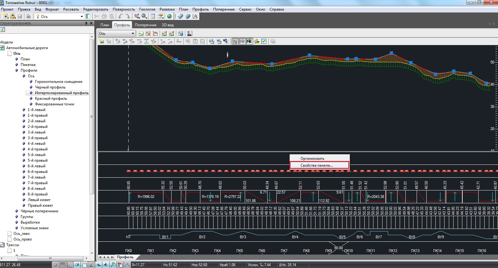

# Настройка отображения продольного профиля

В окне **Профиль** можно настраивать масштаб его отображения, размеры подписей, а также типы данных, которые должны отображаться в шапке продольного профиля.

Для включения менеджера сетки профиля необходимо выполнить следующие действия:

1. Щелкните правой кнопкой мыши по шапке продольного профиля и выберите из появившегося контекстного меню пункт **Свойства панели**:

   

2. В открывшемся окне отметьте галочками те данные, которые должны быть отображены в шапке профиля и нажмите **ОК**.

   

Левой кнопкой мыши можно регулировать ширину строк шапки профиля.

Масштаб профиля, размеры и видимость элементов, отображаемых в его шапке, также можно изменить с помощью общего окна настроек. Для этого воспользуйтесь элементом меню **Сервис-Настройка**.
