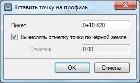

# Визуальное редактирование черного профиля

Табличный способ редактирования черного профиля является наиболее универсальным.

Однако ряд простых операций, таких как удаление лишних точек или добавление дополнительных, можно производить визуальным способом.

## Удалить точку с черного профиля

* Для удаления лишних точек с продольного профиля:

  1. Выберите элемент меню **Профиль - Удалить точку с черного профиля**. Курсор примет форму прицела.
  2. Левой кнопкой мыши последовательно укажите точки, которые необходимо удалить.
  3. Для выхода из режима удаления точек нажмите правую кнопку мыши. Из открывшегося контекстного меню выберите пункт **Завершить**.

При необходимости для отмены удаления последней точки или группы точек воспользуйтесь кнопкой **Отменить** , расположенной на стандартной панели.

## Добавить точку на черный профиль

* Чтобы добавить точку на черный профиль непосредственно из окна **План**, выполните следующие действия:

  1. Выберите элемент меню **Профиль – Добавить точку на черный профиль**. Курсор примет форму прицела.
  2. В окне **План**, перемещаясь вдоль оси, укажите левой кнопкой мыши место, в котором необходимо добавить точку на профиль. Откроется диалоговое окно:

     

  3. Если включена опция **Вычислять отметку точки по черной земле**, то при корректировке пикетажного положения добавляемой точки отметка всегда будет вычисляться по **ЦММ**. Если опция выключена, то точка будет добавлена на черный профиль с отметкой, указанной в соответствующем поле ввода.
  4. Для выхода из текущего режима щелкните правой кнопкой мыши.
