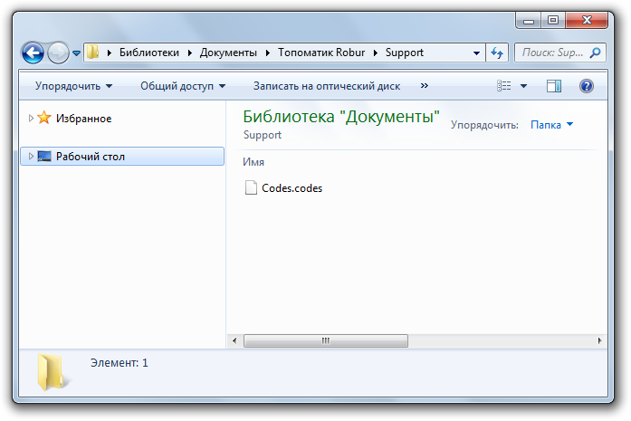
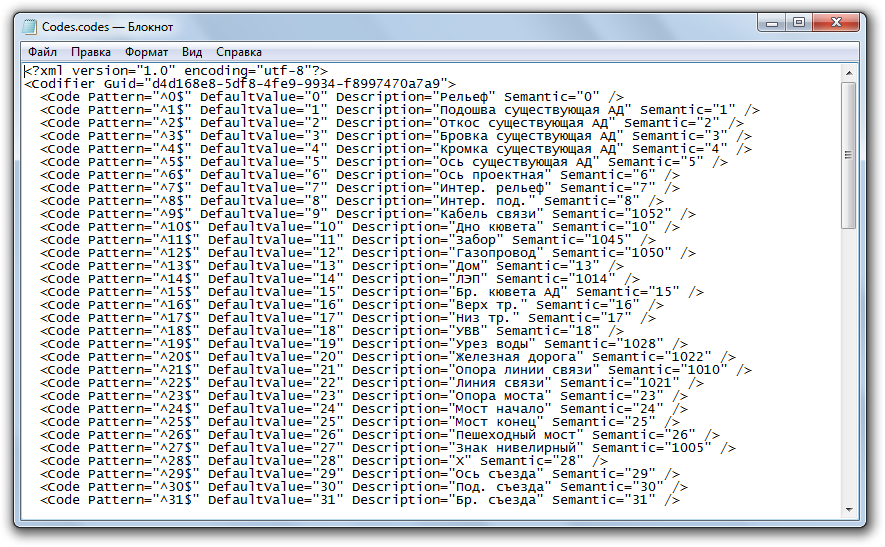
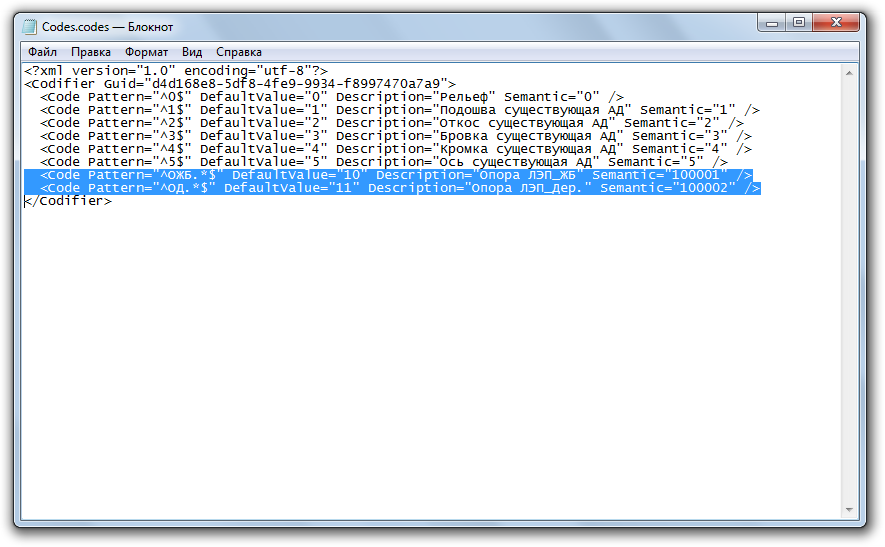
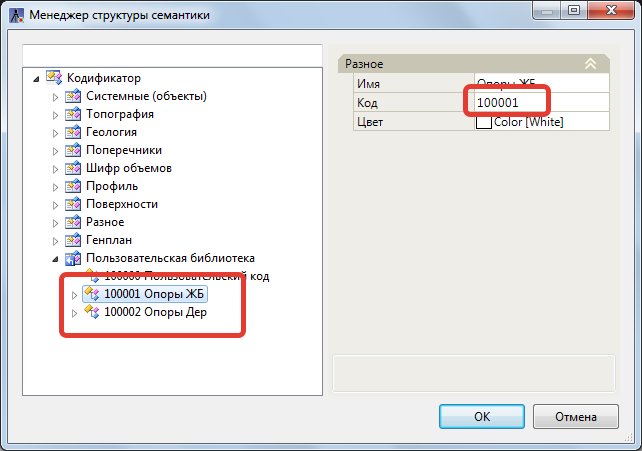
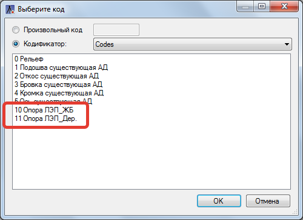
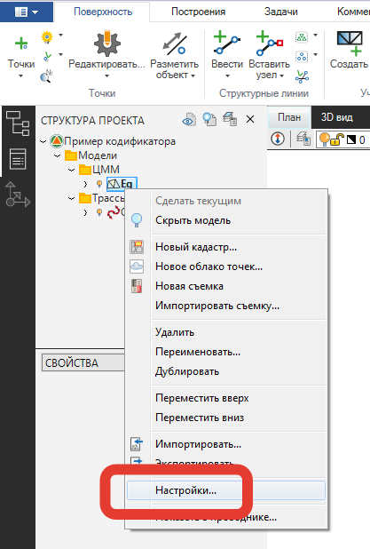
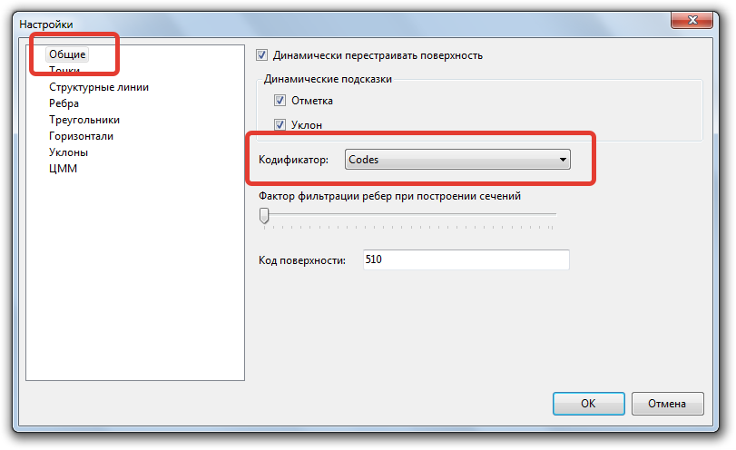
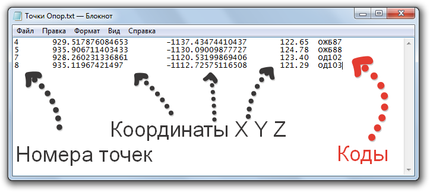
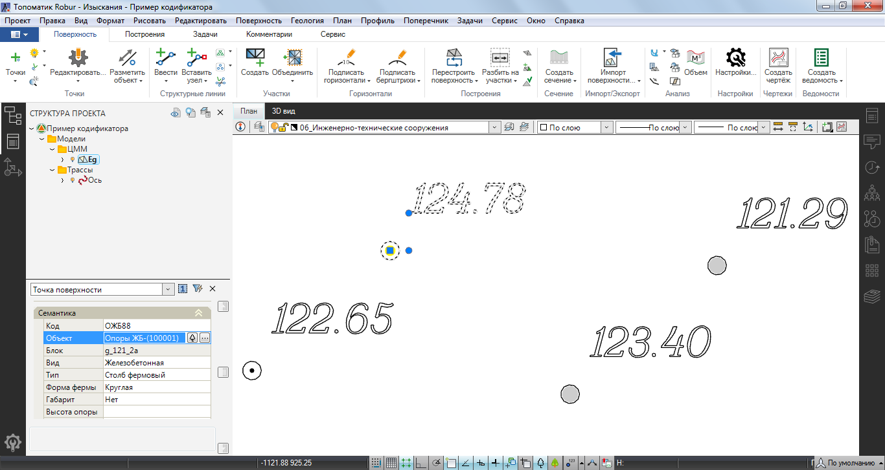

# Создание и редактирование

**Введение:** В данном разделе будет показана последовательность действий создания кодификатора, редактирования, удаление и добавление новых кодов, а также будет показан автоматический механизм сопоставления изыскательских кодов и семантических объектов из программной библиотеки с примером использования регулярных выражений.

**Исходные данные:** Выполнялась съемка местности на которой имелись *опоры ЛЭП ЖБ* и *опоры ЛЭП Дер.* и они были соответственно закодированы кодами: ОЖБ87, ОЖБ89, ОД102, ОД103 и т.д., где:

- **О** - Код объекта «Опора»

- **ЖБ** или **Д** - Материал опор (Железобетонная или Деревянная)

- **87, 88, 102, 103** и т.д. - Номер опоры

**Задача:** Добавить коды в изыскательский кодификатор, автоматически сопоставить эти коды с семантическим объектом (условным знаком).

Для этого:

1. Создадим новый изыскательский кодификатор, для этого:

   1.1. Откройте папку **Codifiers** где находится файл изыскательского кодификатора, по умолчанию это следующий путь - `C:\ProgramData\Topomatic\Robur Survey\16.0\Support\`.

   

   В зависимости от используемой версии и конфигурации программы путь к папке с кодификатором может незначительно отличаться.

   

   1.2. Скопируйте файл изыскательского кодификатора **Robur-Road.codes** в папку **Support** которая находится по следующему пути `C:\My documents\Топоматик Robur\Support\` и переименуем файл кодификатора **Robur-Road.codes**, изменив имя на необходимое, например **Codes.codes**:

   

   

   Настоятельно **НЕ рекомендуем** хранить свой созданный кодификатор в папке **Codifiers** в каталоге `C:\ProgramData\Topomatic\Robur\14.0\Support\` так как при удалении/переустановке программы **{{robur}}**, данные файлы будут удалены или перезаписаны. Рекомендуем хранить свой созданный изыскательский кодификатор в папке **Support** которая находится по в каталоге `C:\My documents\Топоматик Robur\Support`.

   

2. Отредактируем кодификатор, для этого:

   2.1. Откроем изыскательский кодификатор **Codes.codes** с помощью любого текстового редактора.
  
   

   Подробнее структура кодификатора описана выше в разделе [Структура изыскательского кодификатора](structure_codifier.md)

   

   

   2.2. Удалим строки с описанием тех кодов которые не используются. Добавим две новые строки (одна строка для кода Опор\_ЖБ, вторая для кода Опор\_Дер.) с необходимыми параметрами:

   

   Подробнее разберем одну строку для кода Опор ЛЭП\_ЖБ:

 - Поле **Code Pattern**:

   Так как код для ЖБ опор может иметь вид ОЖБ87, ОЖБ88 и т.д., то для того чтобы найти все ЖБ опоры необходимо в поле **Code Pattern** записать выражение: "**ОЖБ.**\*". Данная поисковая запись означает, что будут найдены все изыскательские коды, содержимое которых имеет первые три символа - **ОЖБ**, а следующие символы и их количество может быть любым.

   

   Для данного примера использовались символы регулярных выражений: «.» и «\*». Символ «.»  означает любой символ, а «\*» означает любое количество повторений этого символа. Более подробную информацию о регулярных выражениях можно найти в свободном доступе, например [Wikipedia](https://ru.wikipedia.org/wiki/%D0%A0%D0%B5%D0%B3%D1%83%D0%BB%D1%8F%D1%80%D0%BD%D1%8B%D0%B5_%D0%B2%D1%8B%D1%80%D0%B0%D0%B6%D0%B5%D0%BD%D0%B8%D1%8F) или [Microsoft](https://docs.microsoft.com/ru-ru/dotnet/standard/base-types/regular-expression-language-quick-reference)

   

 - Поле **Semantic**:

   Для того, чтобы назначить соответствующий условный знак для найденных кодов, в поле Semantic задается номер семантического объекта из библиотеки **Менеджер структуры семантики**:

   

   ля данного примера в разделе **Пользовательская библиотека** были созданы два семантических кода с номерами **100001 Опора ЖБ** и **100002 Опора Дер.** с необходимыми условными знаками и набором свойств.

   

   Номер семантического объекта может быть указан как имеющийся в библиотеке так и предварительно добавленный пользователем. Более подробно с созданием новых семантических объектов можно ознакомиться [в соответствующей главе](../../../annex/library_semantics/create_new_objects.md). Подробнее ознакомиться с Библиотекой можно в [Библиотека семантических объектов](../../../annex/library_semantics/semantics.md)

   

 - Поля **DefaultValue** и **Description** - данные текстовые поля заполняются таким образом, как необходимо, чтобы добавленные коды отображались в кодификаторе, окно которого можно открыть, выбрав меню **Поверхность - Точки - Подсветить**:

   

   На данном этапе подготовка изыскательского кодификатора завершена. Закрываем окно и сохраняем изменения в файле кодификатора.

3. Запускаем программу **{{robur}}** и создаем новый проект.

   

   Подробнее см. [Запуск программы](../../../install_startup/startup/startup_program/startup_program.md)

   

   3.1. Так как каждая поверхность может иметь свой изыскательский кодификатор, в свойствах поверхности необходимо указать какой кодификатор будет использоваться. Для этого, щелкните правой кнопкой мыши в **Структуре проекта** и выберите **Настройки**:

   

   В пункте **Общие**, выберите из выпадающего списка необходимый изыскательский кодификатор (в данном случае **Codes**) и нажмите **Ок**:

   

   3.2. Импортируем закодированные точки поверхности из txt-файла, который имеет следующий вид:

   

   

   Подробнее, импорт точек описан в главе [Импорт точек из текстового файла](../sfc/exchange/txt.md)

   

   3.3. В результате, согласно настроенным данным в кодификаторе **Codes.codes**, для импортируемых точек автоматически производится сопоставление изыскательского кода с семантическим объектом:

   
