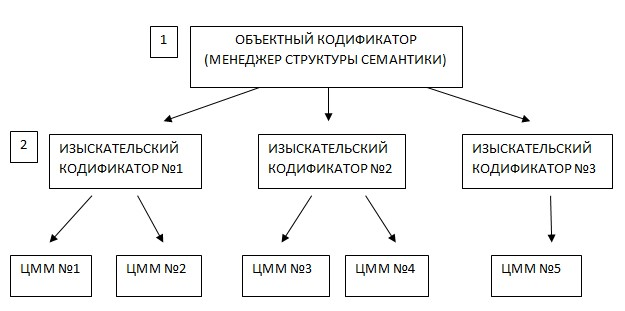

# Общее

Общая структура данных:

1. **Объектный кодификатор** (Менеджер структуры семантики) представляет собой библиотеку дополнительных параметров, которые используются для графического отображения условных знаков, отображения сечений различных условных знаков на продольных и поперечных профилях, отображения объектов на визуализации, набора свойств и т.д. Данный кодификатор хранится в проекте в папке config и представляет собой набор файлов с расширение \*.semantic. Для просмотра и редактирования Объектного кодификатора выберите меню **Сервис – Менеджер структуры семантики**.

   

   Подробное описание см. в [Приложении. Библиотека семантических объектов](../../../annex/library_semantics/semantics.md)

   

2. **Изыскательский кодификатор**. Изыскательский кодификатор предназначен для сопоставления изыскательских кодов с объектными, т.е. при импорте съемки или при работе с уже загруженными точками в проекте, кодификатор позволяет автоматически определить соответствие каждого изыскательского кода с объектом из Менеджера структуры семантики. А также кодификатор позволяет задействовать различный программный функционал для работы с ЦММ, например построение структурных линии по подсвеченным точкам, групповое назначение свойств точкам и т.д.

   

   1. Функционал работы с изыскательским кодификатором см. ниже.
   2. Стандартные изыскательские кодификаторы хранятся в папке в каталоге `C:\ProgramData\Topomatic\Robur Survey\16.0\Support\Codifiers`. В зависимости от используемой версии и конфигурации программы путь к папке с кодификатором может незначительно отличаться.

   

   Изыскательских кодификаторов может быть несколько. Это удобно, когда разные изыскательские партии использую отличную друг от друга кодировку.

   

   Для всех конфигураций программ по умолчанию устанавливается два кодификатора: **Robur-Road.codes** и **Robur-Rail.codes** для решения задач кодирования Автомобильных дорог и Железных дорог соответственно. Отличия в них заключаются только в наборе и наименованиях изыскательских кодов.

   

   Каждой поверхности может соответствовать свой изыскательский кодификатор.

Ниже будет рассмотрен наглядный пример структуры изыскательского кодификатора, создание своего кодификатора и использование его в проекте.
