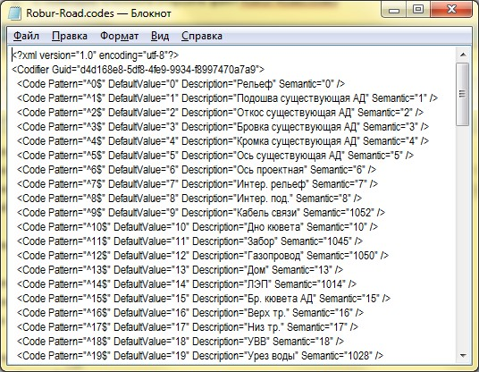
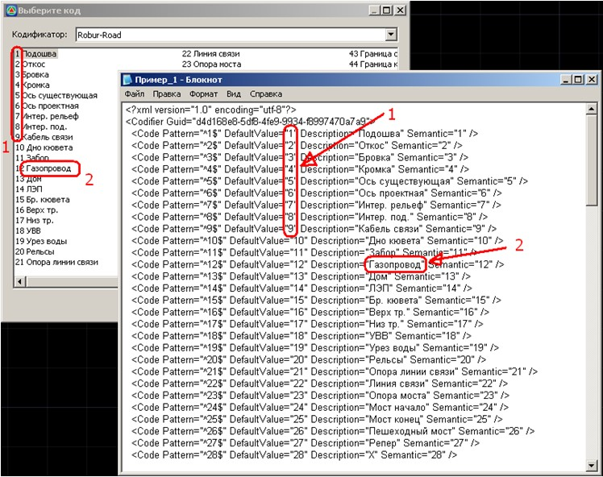

# Структура

1. Откройте папку **Codifiers** где находится файл изыскательского кодификатора, по умолчанию это следующий путь - `C:\ProgramData\Topomatic\Robur Survey\16.0\Support\`.

   

   В зависимости от используемой версии и конфигурации программы путь к папке с кодификатором может незначительно отличаться.

   

2. С помощью любого текстового редактора откройте файл **Robur-Road.codes**:

   

   Каждая строка кодификатора описывает один элемент (код). Каждый элемент содержит четыре параметра:

 * **Code Pattern** – это текстовое поле где задается изыскательский код объекта съемки, который программа будет находить (при импорте поверхности или при работе с уже загруженными точками) и сопоставлять с объектом из программной библиотеки (Менеджер структуры семантики).

   Изыскательский код может быть набором различных символов, т.е. состоять, например только из цифровых\буквенных значений: **1, 54, КН, ИС** и т.д., а также из любого набора символов, например: **1К-Н, 23СТ** и т.д.

   В связи с тем, что система кодирования на предприятии может быть различной и в значение кода при съемке может быть добавлена также информация, например о порядковом номере снимаемого объекта, его характеристике и т.д., в результате, например, снимаемые объекты **Опоры ЛЭП** могут быть закодированы кодами - **ОЖБ87, ОЖБ88** и т.д., где:

 * О - код объекта "Опора"

 * ЖБ - материал опор (Железобетонная)

 * 87, 88 - номер опоры

   В результате получается, что один и тот же объект съемки (Опора) имеет разные изыскательские коды (ОЖБ87, ОЖБ88 и т.д), а объект из библиотеки для всех этих кодов должен быть назначен одинаковый (Опора ЛЭП). Таким образом, для решения задачи нахождения кода и сопоставления его с объектом из библиотеки, необходимо искать (в данном случае) не полное соответствие изыскательского кода, а только его часть, т.е. "ОЖБ", а остальную часть кода (цифры характеризующие номера опор) пропустить. Для решения этой задачи в текстовом поле **Code Pattern** можно использовать синтаксис регулярных выражений.

   

   В следующем разделе документации [Создание и редактирование изыскательского кодификатора](creating_and_applying_codifier.md) приведен пример использования регулярных выражений. Более подробную информацию о регулярных выражениях можно найти в свободном доступе, например [Wikipedia](https://ru.wikipedia.org/wiki/%D0%A0%D0%B5%D0%B3%D1%83%D0%BB%D1%8F%D1%80%D0%BD%D1%8B%D0%B5_%D0%B2%D1%8B%D1%80%D0%B0%D0%B6%D0%B5%D0%BD%D0%B8%D1%8F) или [Microsoft](https://docs.microsoft.com/ru-ru/dotnet/standard/base-types/regular-expression-language-quick-reference)

   

 * **DefaultValue** и **Descriptions** - текстовые поля, определяющие описание объектов изысканий, и отображающиеся непосредственно в самом окне **Кодификатора**, который можно открыть, например, выбрав меню **Поверхность - Точки - Подсветить**.

   

 * **Semantic** – текстовое поле, где указывается номер семантического объекта из **Менеджера структуры семантики**, который должен сопоставиться с точечным объектом съемки согласно изыскательского кода, т.е. указанного в параметре **Code Pattern** (подробнее о см. ниже в следующем разделе).
