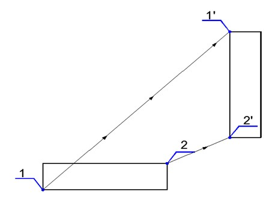
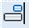

# Выравнивание объектов

Данная команда производит выравнивание объектов относительно других, по нескольким указанным точкам. Эта функция часто используется для переноса объектов из условных координат в требуемые:

*Рис.1. 1 и 2 – исходные точки. 1’ и 2’ – целевые точки.*

Для того, чтобы выровнять объекты выполните следующие действия:

1. Выберите элемент меню **Редактировать – Выровнять** или кнопку  на панели инструментов, либо введите `align` в командную строку.

2. Выделите секущей рамкой или левой кнопкой мыши объекты для редактирования. Далее нажмите правую кнопку мыши, либо **Enter**.

3. Укажите первую исходную точку.

   

   Исходная точка не обязательно должна принадлежать редактируемому объекту. Положение исходной точки, также как и точки совмещения может задаваться визуально или по координатам, значения которых вводятся в строке динамического ввода.

   

4. Укажите первую целевую точку (точка совмещения), с которой в дальнейшем должна совместиться первая исходная точка.
5. Укажите вторую исходную точку.
6. Укажите вторую целевую точку, с которой должна совместиться вторая исходная точка.
7. Программа выдаст запрос, масштабировать ли объекты по точкам выравнивания. При положительном ответе, программа проводит сравнение расстояний между двумя исходными точками и двумя целевыми точками и в случае их разницы масштабирует выравненный объект.

**Применимость команды:** Команда **Выровнять** применима для редактирования чертежей, объектов **ЦММ** и **трасс**.
