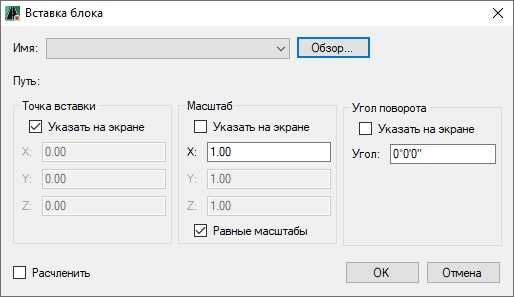
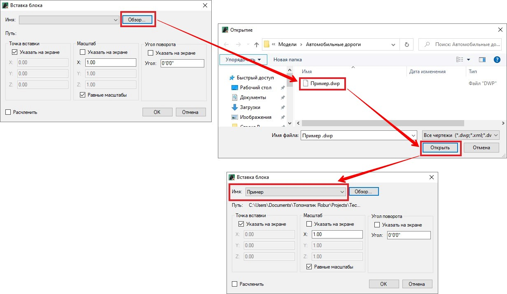

# Задание базовой точки

Данная функция предназначена для задания базовой точки вставки чертежа в текущую модель. Для этого:

1. Откройте чертеж двойным нажатием ЛКМ в структуре проекта.

   

   Описание создания чертежа и импортирование в проект файла с чертежом представлено в разделе [Структура проекта](../../../install_startup/startup/structure_project/structure_project.md).

   

2. Выберите меню **Рисовать – Блок – Базовая точка**.
3. ЛКМ укажите на чертеже необходимую базовую точку вставки, далее сохраните (меню **Проект – Сохранить**) и закройте чертеж.

В результате в выбранном чертеже будет задана и сохранена базовая точка вставки.

*Для вставки чертежа с заданной базовой точкой:*

1. Выберите меню **Рисовать – Блок - Вставить как блок**, откроется окно **Вставка блока**:

   

2. Нажмите кнопку **Обзор**, в открывшемся окне **Открытие** выберите файл с заданной базовой точкой и нажмите **Открыть**. Наименование чертежа отобразится в окне **Вставка блока** в поле **Имя**:

   

3. Вставьте блок в текущую модель, предварительно задав необходимые настройки.

   

   Описание вставки блока представлено в разделе [Вставка блоков](insert_blocks.md).

   

   Перед вставкой блока программа запросит подтверждения переопределения блока, нажмите «*Да*»:

   

В результате в текущую модель вставится чертеж как блок с заданной базовой точкой.
